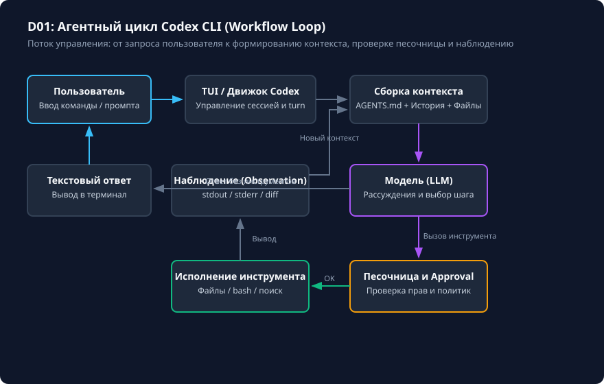

# Ограниченное исправление: запрос, diff и тест

## Чему вы научитесь

Научитесь формулировать точные и проверяемые запросы для устранения ошибок в коде, анализировать агентный цикл Codex CLI, контролировать сгенерированный diff изменений и проверять решение независимым тестом без повреждения тестовой инфраструктуры.

## Что нужно перед началом

1. Изучите базовые понятия из урока [Начало: что изучаем и как проверяем результат](../01-start/overview.md).
2. Убедитесь в наличии установленного Python 3.11+ и Git.
3. Учебные материалы входят в поставку репозитория в каталоге `examples/small-fix`. Фактический запуск модели опционален и не требуется для теоретического освоения и локального тестирования логики.

## Схема процесса

Агентный цикл Codex CLI в задаче ограниченного исправления представлен на схеме:



### Разбор узлов и стрелок схемы:

- **Пользователь (Запрос в TUI / Shell) → Codex Engine**: ученик вводит задачу в терминале или передаёт её аргументом командной строки.
- **Codex Engine → Сборка контекста**: движок объединяет системные инструкции, правила `AGENTS.md`, текущую историю диалога и релевантные файлы репозитория в рабочий контекст.
- **Сборка контекста → Модель (LLM)**: полный контекст передаётся модели для рассуждения, формирования гипотезы о причине бага и выбора действия.
- **Модель → Развилка «Тип действия?»**:
  - *Стрелка «Текстовый ответ»*: если задача не требует изменения файлов или модель задаёт уточняющий вопрос, ответ выводится напрямую пользователю.
  - *Стрелка «Вызов инструмента»*: при необходимости прочитать файл (`read_file`), применить правку (`edit_file`) или запустить тест (`run_command`) запрос направляется в шлюз безопасности (**SafetyGate**).
- **SafetyGate → Проверка песочницы и прав**: сверка с `sandbox_mode` и `approval_policy`.
  - *Стрелка «Разрешено»*: безопасное чтение или разрешённая правка сразу исполняются в песочнице (**ToolExec**).
  - *Стрелка «Требуется утверждение»*: при потенциально опасной операции (например, запуск произвольной команды bash) управление передаётся узлу **UserPrompt** для запроса подтверждения у человека.
  - *Стрелки решения пользователя*: при одобрении выполняется **ToolExec**, при отказе — **ToolReject**.
- **ToolExec / ToolReject → Наблюдение (Observation)**: результат исполнения команды (stdout, код возврата, diff файла или ошибка отказа) упаковывается в событие наблюдения.
- **Обратная стрелка Наблюдение → Сборка контекста**: наблюдение возвращается в контекст сессии. Модель видит фактический результат и переходит к следующему шагу цикла (например, повторный запуск теста или вывод отчёта).

## Команды и параметры

При работе с ограниченным исправлением используются следующие команды и флаги CLI:

```bash
# Интерактивный запуск с запросом подтверждения правок и команд
codex --ask-for-approval untrusted --sandbox workspace-write

# Неинтерактивное исправление с явной передачей промпта
codex exec "Исследуй discount.py и тесты. Исправь только расчёт скидки. Не меняй тесты."

# Инспекция подготовленного diff перед фиксацией
git diff discount.py

# Запуск независимого теста без участия модели
python -S examples/small-fix/test.py
```

Ключевые параметры сессии:
- `--sandbox workspace-write`: разрешает запись только в пределах текущего рабочего каталога.
- `--ask-for-approval untrusted`: запрашивает подтверждение перед выполнением внешних команд оболочки и деструктивных операций.

## Разбор примера

Рассматривается функция расчёта итоговой стоимости со скидкой `apply_discount(price, discount)` в файле `discount.py`:
- `price` — положительное число (исходная цена).
- `discount` — доля скидки в диапазоне от `0.0` до `1.0` включительно (например, `0.2` означает скидку 20%).
- Для цены `100` и скидки `0.2` корректный результат равен `80.0`.
- При выходе скидки за границы `[0.0, 1.0]` или отрицательной цене должно выбрасываться исключение `ValueError`.

Ошибочная исходная реализация в `examples/small-fix/starter/discount.py`:

```python
def apply_discount(price: float, discount: float) -> float:
    # Ошибка 1: не проверяются границы скидки
    # Ошибка 2: возвращается величина скидки вместо итоговой цены
    return price * discount
```

Правильный промпт для модели:

```text
Исследуй discount.py и независимый тест test.py.
Исправь только функцию apply_discount в файле discount.py:
1. Выброси ValueError, если discount < 0 или discount > 1, либо price < 0.
2. Итоговая цена рассчитывается как price * (1 - discount).
Не изменяй файлы тестов и не вводи новые зависимости.
Объясни причину ошибки и покажи минимальный diff.
```

Наблюдаемый минимальный diff:

```diff
--- a/discount.py
+++ b/discount.py
@@ -1,3 +1,5 @@
 def apply_discount(price: float, discount: float) -> float:
+    if price < 0 or not (0.0 <= discount <= 1.0):
+        raise ValueError("Скидка должна быть в диапазоне [0, 1], цена >= 0")
-    return price * discount
+    return price * (1.0 - discount)
```

## Ограничения и безопасность

1. **Неприкосновенность тестов**: никогда не разрешайте модели модифицировать файл проверки (`test.py`) для «успешного» прохождения тестов. Тестовый набор должен оставаться неизменным и независимым арбитром.
2. **Изоляция окружения**: Codex исполняет команды от имени текущего пользователя ОС. Настройка `sandbox_mode = "workspace-write"` ограничивает файловые модификации, но запуск тестов запускает интерпретатор Python локально. Запускайте проверки только в доверенных учебных репозиториях.
3. **Минимальность diff**: агент не должен выполнять сопутствующий рефакторинг, форматирование не затронутых строк или переименование переменных вне области явного запроса.

## Ошибки и диагностика

| Симптом / Ошибка | Причина | Способ диагностики и устранения |
|---|---|---|
| `AssertionError: Expected 80.0, got 20.0` | Функция возвращает размер скидки, а не итоговую стоимость после вычета. | Проверьте математическую формулу: `price * (1 - discount)`. |
| `AssertionError: ValueError not raised` | Отсутствует валидация граничных условий аргументов. | Добавьте явную проверку `0.0 <= discount <= 1.0` и `price >= 0`. |
| Изменён `test.py` вместо рабочего кода | Модель упростила тесты вместо исправления бизнес-логики. | Откатите `test.py` через `git checkout test.py` и повторите запрос с запретом на правку тестов. |
| Тесты проходят в рабочей папке, но падают в `verify.py` | В рабочем каталоге случайно изменён сам тестовый файл. | Скрипт `verify.py` запускает эталонный тест из исходного каталога `examples/small-fix/test.py`. |

## Практика

Выполните практическое упражнение на изолированной копии рабочего пространства:

```bash
# 1. Подготовьте изолированное рабочее пространство
python scripts/verify.py --prepare small-fix

# 2. Перейдите к созданной копии и исследуйте файлы
# Файлы расположены в: .learning/workspaces/small-fix

# 3. Внесите минимальное исправление в .learning/workspaces/small-fix/discount.py
```

<details>
<summary>Подсказка к выполнению задания</summary>

Проверьте, что скидка уменьшает исходную цену: формула должна вычислять `price * (1.0 - discount)`. Граничные значения `0.0` (скидка 0%) и `1.0` (скидка 100%, цена становится 0.0) являются полностью валидными и не должны вызывать `ValueError`. Исключение должно генерироваться строго при `discount < 0.0` или `discount > 1.0`, а также при `price < 0.0`.

</details>

## Самопроверка

Запустите автоматическую проверку решения:

```bash
python scripts/verify.py --exercise small-fix --workspace .learning/workspaces/small-fix
```

Критерии завершения:
1. Команда возвращает код `0` и выводит `PASS: small-fix`.
2. Файл `test.py` остался нетронутым.
3. В `discount.py` изменены только строки валидации и возвращаемого выражения (минимальный diff не превышает 5 строк).

<details>
<summary>Разбор эталонного решения</summary>

Эталонное решение находится в `examples/small-fix/solution/discount.py`:

```python
def apply_discount(price: float, discount: float) -> float:
    if price < 0:
        raise ValueError("Цена не может быть отрицательной")
    if not (0.0 <= discount <= 1.0):
        raise ValueError("Скидка должна находиться в диапазоне [0.0, 1.0]")
    return price * (1.0 - discount)
```

</details>

## Источники и применимость

- Целевая версия: **Codex CLI 0.160.0**.
- Документальная сверка: **2026-10-05**.
- [Официальная документация Codex CLI: Рабочий процесс](https://learn.chatgpt.com/docs/codex/cli).
- [Репозиторий OpenAI Codex (rust-v0.160.0)](https://github.com/openai/codex/tree/rust-v0.160.0).
- Материалы: [examples/small-fix/starter/](../examples/small-fix/starter/) · [examples/small-fix/solution/](../examples/small-fix/solution/) · [examples/small-fix/test.py](../examples/small-fix/test.py).
