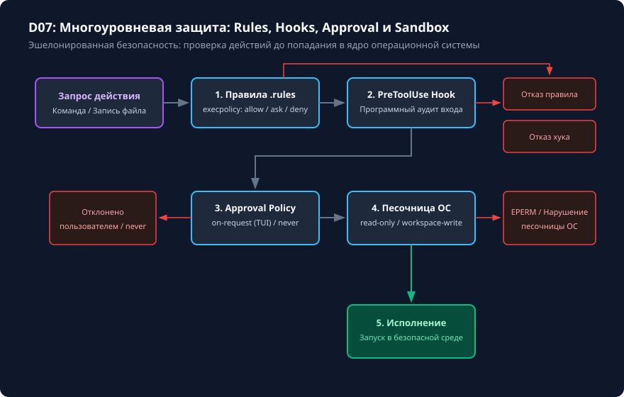

# Разрешения, песочница и безопасные пути

## Чему вы научитесь

Научитесь выбирать минимально необходимые права доступа для задач Codex CLI, настраивать режимы песочницы (`sandbox_mode`) и политики утверждения действий (`approval_policy`), понимать многоуровневую защиту от несанкционированного доступа к файловой системе и валидировать пути в скриптах автоматизации.

## Что нужно перед началом

1. Изучите основы безопасности и авторизации из модуля [Подготовка и первый запуск](../01-start/overview.md).
2. Понимание разницы между программным фильтром путей и аппаратной изоляцией ОС (namespaces, bubblewrap, seatbelt).
3. Учебные материалы и проверяемое упражнение поставляются в `examples/safety-guard/`.

## Схема процесса

Эшелонированная система безопасности Codex CLI представлена на схеме:



### Разбор узлов и стрелок схемы:

- **Запрос на действие от модели**: агент формирует вызов инструмента (чтение файла, запись файла, сетевой запрос или запуск внешней команды).
- **Стрелка → 1. Правила `.rules` (execpolicy)**: статическая декларативная проверка аргументов команды и путей по шаблонам.
  - *Стрелка «DENY»*: немедленная блокировка без обращения к пользователю (**Блокировка: Отказ в запуске**).
  - *Стрелка «ALLOW»*: команда разрешена правилами и передаётся на уровень проверки окружения.
  - *Стрелка «ASK»*: правило предписывает обязательную динамическую валидацию.
- **Стрелка → 2. PreToolUse Hook**: программный перехватчик, способный динамически проанализировать аргументы и вернуть `allow`, `deny` или модифицированные аргументы.
  - *Стрелка «Deny»*: **Блокировка: Отклонено хуком**.
  - *Стрелка «Allow»*: переход к оценке интерактивности.
- **Стрелка → 3. Политика подтверждений (Approval Policy)**:
  - *Ветка «on-request»*: интерактивный запрос к пользователю (**UserPrompt**). Пользователь видит точную команду и diff. При нажатии «Отклонить» — **Блокировка: Отклонено пользователем**, при «Подтвердить» — передача в песочницу.
  - *Ветка «never»*: если операция выходит за рамки гарантированно безопасных, сессия завершается отказом (**Блокировка: Запрет без интерактива**).
- **Стрелка → 4. Песочница ОС (Sandbox Mode)**: уровень изоляции на уровне ядра операционной системы (`read-only`, `workspace-write`).
  - *Стрелка «Попытка выхода за workspace»*: ядро ОС возвращает ошибку `EPERM` или `Permission Denied` (**Блокировка ядра ОС**).
  - *Стрелка «В пределах разрешённой папки»*: действие физически исполняется (**5. Физическое исполнение команды**).

## Команды и параметры

Настройка параметров безопасности в CLI и `config.toml`:

```bash
# Запуск в строго неизменяемом режиме (запись файлов и модификация запрещены)
codex --sandbox-mode read-only --approval-policy on-request

# Стандартный режим разработки (запись разрешена только внутри текущего проекта)
codex --sandbox-mode workspace-write --approval-policy on-request

# Автономный пакетный запуск без интерактива (все небезопасные действия отклоняются)
codex exec --sandbox-mode workspace-write --approval-policy never "Промпт"

# Подключение дополнительного безопасного каталога для чтения/записи
codex --add-dir ../shared-lib
```

Значения ключевых параметров:
- `sandbox_mode`:
  - `"read-only"`: запрещены любые изменения на диске. Идеально для исследовательских задач и аудита кода.
  - `"workspace-write"`: запись разрешена строго в текущий рабочий каталог и явно добавленные через `--add-dir`.
  - `"danger-full-access"`: песочница отключена (не рекомендуется для учебных и недоверенных сред).
- `approval_policy`:
  - `"on-request"`: запрашивать явное подтверждение человека перед выполнением деструктивных действий.
  - `"never"`: никогда не прерывать выполнение на запрос подтверждения. Любое действие, требующее подтверждения, блокируется.

## Разбор примера

Рассмотрим попытку обращения к файлу за пределами рабочего репозитория:

1. Репозиторий расположен в `/home/user/project`.
2. Модель попыталась выполнить команду чтения:
   ```bash
   cat /home/user/.ssh/id_rsa
   ```
3. Реакция эшелонов безопасности:
   - Эшелон 1 (execpolicy): правило запрещает доступ к каталогам `~/.ssh`. Срабатывает DENY.
   - Если бы правило отсутствовало, эшелон 3 (approval_policy) вывел бы в терминал:
     `Codex запрашивает разрешение на чтение: /home/user/.ssh/id_rsa. [y/N]?`
   - При отказе пользователя команда не исполняется, а модели возвращается сообщение об ошибке доступа.

Для защиты путей на уровне Python-скриптов используется правильная нормализация:

```python
from pathlib import Path

def validate_target_path(base_dir: Path, target: str) -> Path | None:
    try:
        resolved = (base_dir / target).resolve()
        # Проверяем строгое вхождение в базовую директорию
        if resolved.is_relative_to(base_dir.resolve()):
            return resolved
    except (ValueError, RuntimeError):
        pass
    return None
```

## Ограничения и безопасность

1. **Недостаточность простого `startswith`**: проверка `str(target).startswith(str(base_dir))` является критической уязвимостью (path traversal bypass): путь `/home/user/project-secret` пройдёт проверку `startswith('/home/user/project')`, хотя находится снаружи. Используйте `Path.resolve()` и `is_relative_to()`.
2. **Символические ссылки**: символические ссылки, указывающие наружу из рабочего пространства, представляют угрозу утечки данных. Песочница Codex по умолчанию не следует по внешним симлинкам при строгой проверке.
3. **`approval_policy = "never"` не даёт вседозволенности**: установка `never` в неинтерактивном режиме означает автоматический отказ от любых действий, требующих подтверждения, а не их молчаливое выполнение.

## Ошибки и диагностика

| Симптом | Причина | Способ диагностики и исправления |
|---|---|---|
| `Permission denied: /etc/hosts` | Песочница ОС заблокировала попытку записи вне рабочего каталога. | Убедитесь, что задача не пытается модифицировать системные файлы. Запись разрешена только внутри workspace. |
| Ошибка `Blocked by approval policy` в фоновом скрипте | Скрипт запущен с `--approval-policy never`, и команда потребовала подтверждения. | Задайте точные разрешающие правила в `.rules` или используйте безопасный инструмент чтения. |
| Симлинк не читается внутри проекта | Символическая ссылка указывает за пределы разрешённого каталога (`symlink escape`). | Замените внешнюю ссылку копией файла или добавьте целевой каталог через `--add-dir`. |

## Практика

Выполните проверяемое упражнение по безопасной валидации путей `safety-guard`:

```bash
# 1. Подготовьте изолированное рабочее пространство
python scripts/verify.py --prepare safety-guard

# 2. Перейдите в рабочее пространство:
# .learning/workspaces/safety-guard

# 3. Реализуйте функцию безопасной валидации в path_guard.py
```

<details>
<summary>Подсказка к реализации валидатора путей</summary>

Функция `validate_target_path(base: Path, user_path: str)` должна:
1. Разрешать абсолютные пути и пути с `..` через `(base / user_path).resolve()`.
2. Проверять `path.is_relative_to(base.resolve())`.
3. Запрещать пути, являющиеся символическими ссылками на внешние объекты (`path.is_symlink()` с разрешением вне `base`).
4. Возвращать `None`, если путь выходит наружу, и нормализованный `Path` в случае успеха.

</details>

## Самопроверка

Запустите независимый проверочный скрипт:

```bash
python scripts/verify.py --exercise safety-guard --workspace .learning/workspaces/safety-guard
```

Критерии завершения:
1. Проверочный тест возвращает `PASS: safety-guard`.
2. Все негативные мутации (попытки обхода через `..`, соседний префикс имени каталога, абсолютные пути и симлинки) успешно блокируются.
3. Вы можете объяснить каждый из 4 эшелонов безопасности на схеме D07.

<details>
<summary>Разбор эталонного решения</summary>

В `examples/safety-guard/solution/path_guard.py` используется:
```python
def validate_target_path(base_dir: Path, target: str) -> Path | None:
    try:
        base = base_dir.resolve()
        candidate = (base / target).resolve()
        if candidate.is_relative_to(base):
            return candidate
    except Exception:
        return None
    return None
```
Такой подход гарантирует корректную работу в любых операционных системах с сохранением строгих границ песочницы.

</details>

## Источники и применимость

- Целевая версия: **Codex CLI 0.160.0**.
- Документальная сверка: **2026-10-05**.
- [Официальное руководство по безопасности и разрешениям Codex](https://learn.chatgpt.com/docs/permissions).
- [Справочник конфигурации и песочницы](https://learn.chatgpt.com/docs/config-file/config-reference).
- [Репозиторий OpenAI Codex (rust-v0.160.0)](https://github.com/openai/codex/tree/rust-v0.160.0).
- Материалы: [examples/safety-guard/starter/](../examples/safety-guard/starter/) · [examples/safety-guard/solution/](../examples/safety-guard/solution/) · [examples/safety-guard/test.py](../examples/safety-guard/test.py).
