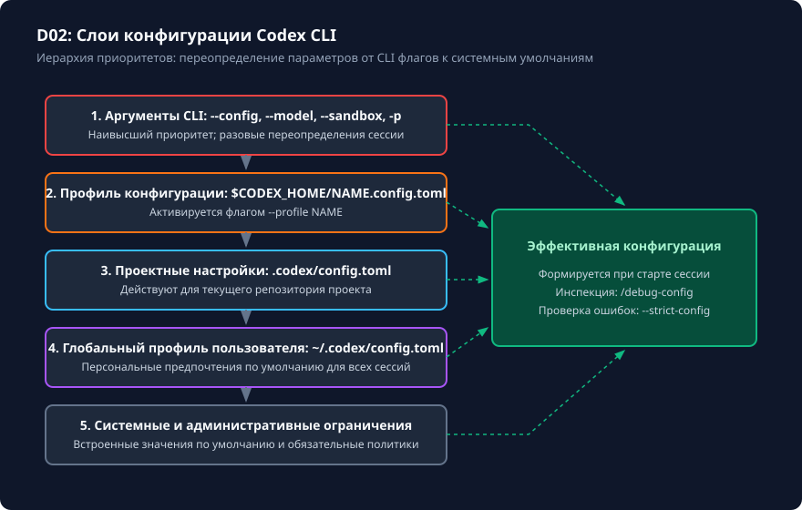

# config.toml: реальные ключи и приоритеты

## Чему вы научитесь

Научитесь определять и контролировать иерархию конфигурационных слоёв в Codex CLI 0.160.0, настраивать параметры безопасности, модели и инструментов в файлах `config.toml`, проверять эффективную конфигурацию с помощью встроенных инструментов отладки и предотвращать конфликты между глобальными и проектными профилями.

## Что нужно перед началом

1. Изучите основы структуры проекта и настройки окружения из модуля [Подготовка и первый запуск](../01-start/overview.md).
2. Ознакомьтесь с расположением каталога конфигурации: по умолчанию `$HOME/.codex` (в Linux/macOS) или `%USERPROFILE%\.codex` (в Windows), либо значение переменной `CODEX_HOME`.
3. Учебный файл базовой конфигурации поставляется в репозитории: `examples/config/minimal.config.toml`.

## Схема процесса

Иерархия применения настроек и вычисление результирующего состояния сессии представлены на схеме:



### Разбор узлов и стрелок схемы:

- **1. Аргументы командной строки (CLI Flags)**: наивысший приоритет. Флаги `--model`, `--sandbox`, `--ask-for-approval`, `-c key=value` переопределяют любые файловые значения.
- **2. Именованный профиль (`$CODEX_HOME/NAME.config.toml`)**: активируется флагом `--profile NAME`. Содержит специализированные наборы настроек для конкретных рабочих контекстов (например, профиль строгого ревью или изолированного запуска).
- **3. Проектная конфигурация (`.codex/config.toml`)**: файл в корне текущего репозитория. Содержит параметры, общие для всех участников разработки проекта (например, список разрешённых MCP-серверов или режим песочницы).
- **4. Глобальный профиль пользователя (`~/.codex/config.toml`)**: персональные предпочтения разработчика на конкретной машине (по умолчанию используемая модель, язык интерфейса, телеметрия).
- **5. Системные и административные ограничения**: системные умолчания и политики организации. Задают фундаментальные ограничения (например, запрет небезопасных режимов песочницы), которые не могут быть ослаблены проектными файлами.
- **Стрелки переопределения («Переопределяет»)**: демонстрируют направленный поток каскада от наивысшего приоритета к базовому (CLI → Profile → Project → Global → System).
- **Пунктирные стрелки к узлу «Эффективная конфигурация сессии»**: показывают, что итоговый набор параметров вычисляется однократно в момент старта сессии путём слияния всех слоёв и фиксируется в оперативной памяти. Его можно проинспектировать через команду `/debug-config`.

## Команды и параметры

Codex CLI 0.160.0 использует стандартные параметры конфигурации TOML:

```toml
# Ключевые параметры первого уровня в config.toml:
model = "gpt-5-codex"
sandbox_mode = "workspace-write"       # "read-only" | "workspace-write" | "danger-full-access"
approval_policy = "on-request"         # "never" | "on-request"
web_search = "disabled"                # "enabled" | "disabled"

[mcp_servers.sqlite]
command = "python"
args = ["-m", "mcp_server_sqlite", "--db", "app.db"]
```

Команды управления и инспекции конфигурации:

```bash
# Запуск с указанием конкретного именованного профиля
codex --profile security-audit

# Переопределение конкретного ключа при запуске сессии
codex -c sandbox_mode=read-only -c approval_policy=on-request

# Запуск со строгой валидацией схемы конфигурации (ошибка при неизвестных ключах)
codex --strict-config

# Внутри интерактивной сессии TUI:
/debug-config   # Выводит сводную таблицу эффективных параметров и источники значений
```

## Разбор примера

Рассмотрим слияние конфигураций при наличии глобального и проектного файлов.

Глобальный файл `~/.codex/config.toml`:
```toml
model = "gpt-5-codex"
approval_policy = "on-request"
sandbox_mode = "read-only"
web_search = "enabled"
```

Проектный файл `.codex/config.toml` в репозитории:
```toml
# Репозиторий требует записи в рабочее пространство для тестов
sandbox_mode = "workspace-write"
web_search = "disabled"
```

Команда запуска ученика:
```bash
codex -c model=gpt-5-codex-fast
```

Результирующая эффективная конфигурация, отображаемая по команде `/debug-config`:
- `model`: `"gpt-5-codex-fast"` (источник: аргумент командной строки `-c`, наивысший приоритет).
- `sandbox_mode`: `"workspace-write"` (источник: проектный `.codex/config.toml`, переопределил глобальный `read-only`).
- `approval_policy`: `"on-request"` (источник: глобальный `~/.codex/config.toml`, так как проектный файл его не переопределял).
- `web_search`: `"disabled"` (источник: проектный `.codex/config.toml`, переопределил глобальное значение).

## Ограничения и безопасность

1. **Недопустимость устаревших секций**: в версии 0.160.0 не используется устаревший синтаксис таблиц `[profiles.NAME]`. Каждый именованный профиль хранится в отдельном файле `NAME.config.toml`.
2. **Административные ограничения**: проектный файл `.codex/config.toml` не имеет права расширять права доступа дальше, чем разрешено политикой ОС или системным профилем.
3. **Безопасность репозитория**: проектный `.codex/config.toml` коммитится в Git, поэтому никогда не должен содержать секретов, персональных токенов или путей к локальным файлам вне репозитория.

## Ошибки и диагностика

| Ошибка / Сообщение | Причина | Способ исправления |
|---|---|---|
| `Unknown key 'provider' in config.toml` | Использование неподдерживаемого ключа старой версии или опечатка в имени поля. | Запустите проверку со схемой: `scripts/check_project.py config` и удалите неизвестные ключи. |
| Настройки проектного файла игнорируются | Рабочий каталог запуска CLI не совпадает с корнем репозитория или файл назван не `.codex/config.toml`. | Убедитесь, что запускаете команду из корня проекта, где присутствует подкаталог `.codex/`. |
| `Configuration error: strict-config validation failed` | В одном из файлов конфигурации обнаружено незарегистрированное поле. | Выполните `/debug-config` для выявления файла-источника ошибочного ключа. |

## Практика

1. Создайте временный профиль с безопасными настройками в учебном каталоге:
   ```bash
   mkdir -p .learning/workspaces/config-lab/.codex
   cat << 'EOF' > .learning/workspaces/config-lab/.codex/config.toml
   sandbox_mode = "workspace-write"
   approval_policy = "on-request"
   web_search = "disabled"
   EOF
   ```
2. Проверьте синтаксис конфигурации встроенным верификатором:
   ```bash
   python scripts/check_project.py config
   ```
3. Добавьте в тестовый файл заведомо неизвестный ключ `custom_param = 123` и повторите проверку, чтобы увидеть диагностическое предупреждение.

<details>
<summary>Подсказка к выполнению практики</summary>

Скрипт `scripts/check_project.py config` валидирует файлы в каталоге `examples/config/*.toml`. Для проверки своего учебного файла можно временно сохранить его как `examples/config/test.config.toml` и запустить скрипт, убедившись, что валидатор обнаруживает любые отклонения от схемы разрешённых полей.

</details>

## Самопроверка

Критерии успешного освоения материала:
1. Вы можете безошибочно назвать порядок приоритетов: CLI → Profile → Project → Global → System.
2. Вы умеете получить и проанализировать эффективную конфигурацию через команду `/debug-config`.
3. Все поставляемые конфигурационные файлы проекта проходят проверку `python scripts/check_project.py config` со статусом `PASS`.

<details>
<summary>Контрольные вопросы для самопроверки</summary>

- **Вопрос**: Если в `~/.codex/config.toml` указан `sandbox_mode = "read-only"`, а при запуске передан флаг `-c sandbox_mode=workspace-write`, какой режим применится?
- **Ответ**: Применится `workspace-write`, так как аргументы командной строки обладают наивысшим приоритетом в иерархии каскада.
- **Вопрос**: Где должен располагаться именованный профиль `audit` в версии 0.160.0?
- **Ответ**: В файле `$CODEX_HOME/audit.config.toml`, а не в таблице `[profiles.audit]` внутри основного файла.

</details>

## Источники и применимость

- Целевая версия: **Codex CLI 0.160.0**.
- Документальная сверка: **2026-10-05**.
- [Официальный справочник конфигурации Codex CLI](https://learn.chatgpt.com/docs/config-file/config-reference).
- [Базовая конфигурация и профили](https://learn.chatgpt.com/docs/config-file/config-basic).
- [Схема core config.schema.json (rust-v0.160.0)](https://github.com/openai/codex/tree/rust-v0.160.0).
