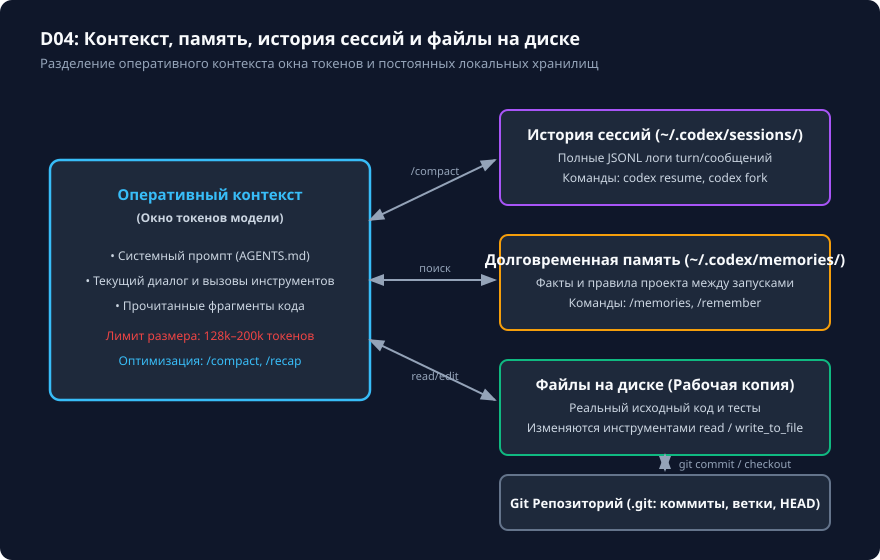

# Контекст беседы, /status и /compact

## Чему вы научитесь

Научитесь разделять оперативный контекст сессии, историю диалога, долговременную память и файлы репозитория в Codex CLI 0.160.0, контролировать расход контекстного окна через `/status`, выполнять безопасное сжатие истории командой `/compact` и сохранять архитектурные решения от деградации при длительных сессиях.

## Что нужно перед началом

1. Изучите материал урока [config.toml: реальные ключи и приоритеты](config.md).
2. Понимание разницы между энергозависимым окном внимания LLM (RAM/Tokens) и постоянным дисковым хранилищем (Git, JSONL-сессии).
3. Доступ к терминалу для проведения учебной сессии.

## Схема процесса

Взаимодействие между оперативным контекстом, дисковыми хранилищами и состоянием Git отображено на схеме:



### Разбор узлов и стрелок схемы:

- **Оперативный контекст сессии (RAM / Окно токенов)**:
  - Узел **Активный промпт**: строго ограниченный объём токенов, передаваемый модели при каждом ходе. Включает базовые правила, последние сообщения и фрагменты прочитанных файлов.
- **Постоянные хранилища на диске (Disk)**:
  - Узел **История диалога (`~/.codex/sessions/*.jsonl`)**: журнал сессии, содержащий полную и точную хронологию сообщений, событий и вызовов инструментов. Сохраняется независимо от сжатия контекста.
  - Узел **Долговременная память (`~/.codex/memories/`)**: база структурированных заметок и соглашений, переносимых между сессиями.
  - Узел **Файлы рабочей копии (Git)**: текущие физические файлы в рабочей директории.
  - Узел **Git История коммитов**: состояние коммитов репозитория.
- **Стрелки взаимодействий**:
  - Двунаправленная стрелка **Активный промпт ⟷ История диалога (`/compact`, `/recap`)**: команда `/compact` берёт подробную историю, формирует сжатую сводку ключевых решений и помещает её в активный промпт, освобождая контекстное окно. Исходные строки в JSONL-файле на диске при этом не удаляются.
  - Двунаправленная стрелка **Активный промпт ⟷ Долговременная память (`/memories`)**: просмотр и извлечение сохранённых решений между запусками.
  - Двунаправленная стрелка **Активный промпт ⟷ Файлы рабочей копии**: чтение и редактирование файлов инструментами агента.
  - Стрелка **Файлы рабочей копии ⟷ Git История**: фиксация состояния через `git commit` и откат через `git restore`.

## Команды и параметры

Для мониторинга и управления контекстом используются встроенные команды TUI:

```text
/status      # Выводит текущее использование токенов, модель, режим песочницы и размер истории
/compact     # Запускает сжатие текущего контекста с формированием краткого резюме
/recap       # Отображает текущую сводку контекста после сжатия
/memories    # Просмотр постоянных заметок о проекте
/clear       # Очистка оперативного контекста с сохранением сессии на диске
```

Флаги CLI для управления поведением сессии:

```bash
# Неинтерактивное выполнение задачи с потоковым выводом событий в JSONL
codex exec --json "Выполни ревизию контекста"

# Выполнение с сохранением финального ответа в файл
codex exec --output-last-message summary.txt "Выполни ревизию контекста"
```

## Разбор примера

Рассмотрим жизненный цикл длинной сессии разработки:

1. До сжатия по команде `/status`:
   ```text
   Model: gpt-5-codex
   Context: 184,200 / 200,000 tokens (92% used)
   History: 48 turns, 12 files read
   Sandbox: workspace-write
   ```
2. Фиксация текущего состояния перед сжатием:
   Пользователь вводит промпт:
   ```text
   Зафиксируй текущий статус:
   1. Что сделано: функция apply_discount реализована и протестирована.
   2. Текущий шаг: переход к реализации get_tax_rate в tax.py.
   3. Запрет: не трогать файлы в migrations/.
   ```
3. Выполнение команды сжатия:
   ```text
   /compact
   ```
4. После сжатия по команде `/status`:
   ```text
   Model: gpt-5-codex
   Context: 12,400 / 200,000 tokens (6% used)
   Summary: 1 compaction recap retained
   Sandbox: workspace-write
   ```
   Контекстное окно освобождено на 86%, но вся важная информация о выполненных шагах и ограничениях осталась в сводке.

## Ограничения и безопасность

1. **Потеря деталей при сжатии**: `/compact` удаляет промежуточный шум (длинные выводы линтеров, промежуточные трассировки ошибок). Точные номера строк или второстепенные детали могут стереться. Всегда фиксируйте критические требования в файлах или в явном промпте перед сжатием.
2. **Разделение сущностей**: сжатие контекста (`/compact`) НЕ изменяет и НЕ откатывает файлы в Git. Изменения на диске сохраняются в рабочем дереве.
3. **Безопасность памяти**: долговременная память (`/memories`) сохраняется между запусками. Не заносите в неё чувствительные данные (пароли, API-ключи, токены).

## Ошибки и диагностика

| Ситуация / Ошибка | Причина | Способ решения |
|---|---|---|
| Модель забыла ранее введённый запрет после `/compact` | Требование было сформулировано вскользь в начале длинного диалога и отсечено при сжатии. | Продублируйте ключевые запреты в файле `AGENTS.md` репозитория — они включаются в каждый ход независимо от сжатия. |
| Ошибка переполнения контекста (`ContextWindowExceeded`) | Сессия набрала слишком много данных без своевременного вызова `/compact`. | Выполните `/compact` или начните новый тред, указав нужные файлы через `codex resume <session_id>`. |
| Ожидание, что `/compact` откатит неверно отредактированный файл | Смешение концепций окна внимания и состояния Git. | Для отката файлов используйте `git checkout` или `git restore`. |

## Практика

1. Изучите текущий размер контекста и параметры сессии с помощью `/status`.
2. Смоделируйте подготовку к сжатию: составьте краткую памятку из 3 пунктов (задача, ограничения, следующий шаг).
3. Выполните команду `/compact` и проверьте, как изменились показатели использования токенов.

<details>
<summary>Подсказка по составлению сводки перед сжатием</summary>

Хорошая сводка перед сжатием отвечает на три вопроса:
1. Какая часть задачи уже полностью закрыта и проверена тестами?
2. Какие файлы были изменены и где лежит их diff?
3. Какая конкретная подзадача должна решаться на следующем шаге?
Такой формат позволяет модели сразу продолжить работу без повторного анализа репозитория.

</details>

## Самопроверка

Критерии завершения урока:
1. Вы понимаете разницу между активным контекстом в оперативной памяти и неизменяемым файлом истории `.jsonl` на диске.
2. Вы умеете вовремя применять `/compact` до наступления переполнения контекстного окна.
3. Вы знаете, что долговременные архитектурные требования должны фиксироваться в `AGENTS.md`, а не передаваться однократным сообщением в чат.

<details>
<summary>Контрольные вопросы для самопроверки</summary>

- **Вопрос**: Удаляет ли команда `/compact` файлы из каталога `~/.codex/sessions/`?
- **Ответ**: Нет, файлы истории сессий на диске остаются полными и неизменными; сжимается только оперативное окно внимания модели в текущем сеансе.
- **Вопрос**: Что надёжнее для сохранения глобальных правил проекта: надеяться на память модели после `/compact` или записать их в `AGENTS.md`?
- **Ответ**: Однозначно записать в `AGENTS.md`, так как содержимое этого файла заново инжектируется при каждом обращении к модели.

</details>

## Источники и применимость

- Целевая версия: **Codex CLI 0.160.0**.
- Документальная сверка: **2026-10-05**.
- [Интерфейс и справочник команд Codex CLI](https://learn.chatgpt.com/docs/developer-commands?surface=cli).
- [Управление контекстом и историей сессий](https://learn.chatgpt.com/docs/agent-configuration/agents-md).
- [Репозиторий OpenAI Codex (rust-v0.160.0)](https://github.com/openai/codex/tree/rust-v0.160.0).
