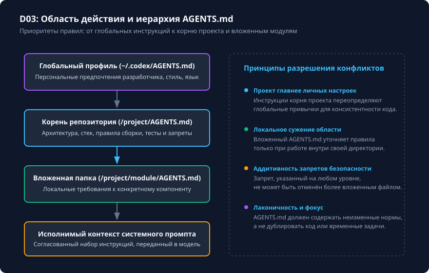

# Область действия AGENTS.md и вложенные инструкции

## Чему вы научитесь

Научитесь разделять глобальные, проектные и подкаталожные правила поведения агента с помощью иерархических файлов `AGENTS.md`, организовывать локальные контексты для независимых модулей репозитория и предотвращать коллизии инструкций.

## Что нужно перед началом

1. Изучите основы структуры инструкций из урока [Начало: что изучаем и как проверяем результат](../01-start/overview.md).
2. Подготовьте учебную структуру каталогов с подпроектом (например, корневой проект и вложенный каталог сервиса).
3. Понимание базового принципа: инструкции `AGENTS.md` читаются моделью как контекст естественного языка, но формируются по строгим правилам иерархического разрешения.

## Схема процесса

Разрешение областей видимости и объединение файлов `AGENTS.md` показаны на схеме:



### Разбор узлов и стрелок схемы:

- **Глобальные правила пользователя (`~/.codex/AGENTS.md`)**: фундаментальный уровень предпочтений разработчика (предпочитаемый язык ответов, формат вывода, персональные соглашения кодирования).
- **Стрелка «Базовый контекст» → Корень репозитория (`<project_root>/AGENTS.md`)**: глобальные правила передаются в контекст корня проекта.
- **Корень репозитория**: формулирует стандарты конкретного репозитория: используемый стек технологий, архитектурные слои, команды линтинга и независимого запуска тестов.
- **Стрелка «Приоритет проекта над глобальным» → Вложенный каталог (`frontend/AGENTS.md`)**: проектный файл превалирует над пользовательскими привычками, если между ними возникает расхождение.
- **Вложенный каталог компонента**: содержит специализированные правила конкретной подсистемы (например, соглашения по стилизации компонентов, запрет прямых импортов из backend).
- **Стрелка «Локальное сужение контекста» → Исполнимый контекст промпта**: при переходе агента к работе с файлами внутри `frontend/` инструкции этого каталога динамически дополняют системный контекст.
- **Блок «Границы ответственности»**:
  - *Узел B1*: общие команды сборки и запуска тестов всегда наследуются из корня проекта.
  - *Узел B2*: правила и запреты безопасности действуют аддитивно — запрет редактирования тестов или секретов, заданный в корневом файле, не может быть отменён локальным `AGENTS.md`.
  - *Узел B3*: инструкции вложенного каталога не засоряют контекст сессии, если задача выполняется строго в другом несвязанном каталоге репозитория.

## Команды и параметры

Управление инструкциями осуществляется через файлы Markdown и стандартные команды:

```bash
# Проверка наличия инструкций в корне и вложенных модулях
ls -la AGENTS.md services/api/AGENTS.md

# Запуск Codex с указанием рабочего каталога конкретного компонента
codex -C services/api

# В интерактивном TUI: просмотр активных загруженных инструкций
/debug-instructions   # Отображает цепочку загруженных файлов AGENTS.md
```

Пример оформления корневого `AGENTS.md`:
```markdown
# Стандарты проекта
- Язык взаимодействия: русский.
- Не модифицируй независимые тесты без явного разрешения.
- Всегда запускай локальный линтер перед завершением задачи.
```

Пример вложенного `services/api/AGENTS.md`:
```markdown
# Правила сервиса API
- Для валидации моделей используй Pydantic v2.
- Не импортируй напрямую сущности из пакета `services/legacy`.
```

## Разбор примера

Рассмотрим монорепозиторий, содержащий `frontend` и `backend`.

1. В корне репозитория задано:
   ```markdown
   Отвечай по-русски. Запрещено трогать файлы с расширением .env и ключи доступа.
   ```
2. В `frontend/AGENTS.md` задано:
   ```markdown
   Используй строгий TypeScript без `any`. Для стилей используй CSS Modules.
   ```
3. При запросе ученика: `Исправь валидацию формы в frontend/LoginForm.tsx`:
   - Codex загружает глобальные правила (русский язык, запрет секретов).
   - Подключает корневой `AGENTS.md` (базовые ограничения).
   - Загружает `frontend/AGENTS.md` (TypeScript без `any`, CSS Modules).
   - Модель формирует решение строго в соответствии с локальными требованиями `frontend`, сохраняя глобальный запрет на изменение `.env`.

## Ограничения и безопасность

1. **Аддитивность ограничений**: локальный файл инструкций не может отменить запреты корневого файла. Если в корне запрещено менять конфигурацию CI, инструкция `в этой папке разрешено менять .github/workflows` игнорируется политикой безопасности.
2. **Размер контекста**: избыточные `AGENTS.md` большого объёма вытесняют полезный контекст диалога. Формулируйте правила лаконично (до 100–150 строк на файл).
3. **Отсутствие автоматического применения к старым сессиям**: добавление или изменение `AGENTS.md` в процессе диалога требует перезапуска или явной команды обновления контекста (`/compact` или создание нового треда).

## Ошибки и диагностика

| Проблема | Причина | Способ устранения |
|---|---|---|
| Модель игнорирует локальный `AGENTS.md` | Файл назван неточно (например, `agents.md` в нижнем регистре на чувствительных к регистру ФС) или путь выходит за рамки рабочей папки. | Назовите файл строго `AGENTS.md` прописными буквами. |
| Противоречие инструкций: модель действует хаотично | Корневой и вложенный файлы дают взаимоисключающие указания без иерархии. | Вынесите общее в корень, а во вложенном файле используйте формулировки уточнения. |
| Переполнение контекста инструкциями | Размещение документации и справочников API внутри `AGENTS.md`. | Выносите документацию в справочники и навыки (`skills/`), подключаемые по требованию. |

## Практика

1. Создайте в учебном каталоге структуру из двух уровней инструкций:
   ```bash
   mkdir -p .learning/workspaces/scope-lab/subsystem
   echo "# Корневые правила: отвечать на русском" > .learning/workspaces/scope-lab/AGENTS.md
   echo "# Правила подсистемы: добавлять префикс [SUB] к логам" > .learning/workspaces/scope-lab/subsystem/AGENTS.md
   ```
2. Проверьте поведение модели или инспектора инструкций при переходе между папками.

<details>
<summary>Подсказка к заданию</summary>

При формулировании инструкций для подкаталогов начинайте с заголовка области: `# Подсистема <имя>`. Указывайте только те требования, которые специфичны для файлов внутри этой папки. Правила форматирования всего репозитория всегда держите в корневом файле.

</details>

## Самопроверка

Критерии завершения:
1. Вы можете объяснить, почему правила безопасности корневого файла превалируют над локальными файлами.
2. Файлы `AGENTS.md` размещены в нужных каталогах с точным соблюдением регистра.
3. Вложенные инструкции не дублируют текст корневого файла, а только дополняют его.

<details>
<summary>Контрольные вопросы для самопроверки</summary>

- **Вопрос**: Может ли локальный `frontend/AGENTS.md` разрешить удаление файлов тестов, если корневой `AGENTS.md` содержит строгий запрет на изменение тестов?
- **Ответ**: Нет, правила безопасности и запреты действуют аддитивно — локальный контекст может только сузить область допустимых действий, но не отменить корневой запрет.
- **Вопрос**: Что произойдёт, если рабочий каталог переключится на `backend/`?
- **Ответ**: Инструкции из `frontend/AGENTS.md` будут исключены из контекста сессии, а применятся корневые правила и правила `backend/AGENTS.md` (если файл существует).

</details>

## Источники и применимость

- Целевая версия: **Codex CLI 0.160.0**.
- Документальная сверка: **2026-10-05**.
- [Официальная документация: Конфигурация AGENTS.md](https://learn.chatgpt.com/docs/agent-configuration/agents-md).
- [Репозиторий OpenAI Codex (rust-v0.160.0)](https://github.com/openai/codex/tree/rust-v0.160.0).
