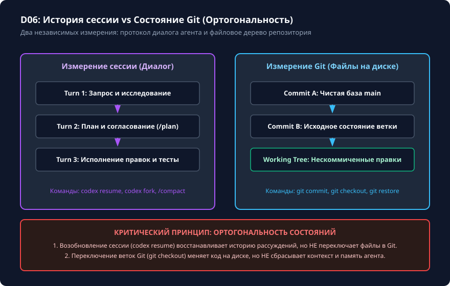

# Продолжение сессии не восстанавливает файлы

## Чему вы научитесь

Научитесь управлять сессиями Codex CLI с помощью команд `codex resume` и `codex fork`, понимать принципиальную ортогональность между журналом диалога и файловой системой Git, предотвращать ошибки рассинхронизации контекста и восстанавливать прерванную разработку без потери артефактов.

## Что нужно перед началом

1. Изучите основы работы с Git (коммиты, рабочее дерево, откат файлов).
2. Ознакомьтесь с материалом урока [Контекст беседы, /status и /compact](../04-instructions/context.md).
3. Учебные материалы и проверяемое упражнение поставляются в `examples/session-restore/`.

## Схема процесса

Ортогональность и независимость пространства диалога Codex и пространства состояний репозитория Git показаны на схеме:



### Разбор узлов и стрелок схемы:

- **Пространство диалога (Codex Session)**:
  - Последовательность ходов диалога: **Turn 1 (Промпт)** → **Turn 2 (План `/plan`)** → **Turn 3 (Правка кода)** → **Turn 4 (Прогон тестов)**.
  - Управление сессией (**S_Ctrl**): команды `codex resume` (выбор и возобновление диалога), `codex fork` (создание независимой копии ветки диалога для альтернативного решения), `/compact` (сжатие истории).
- **Пространство репозитория (Git Repository)**:
  - Линейка версий: **Commit A** → **Commit B** → **Рабочая копия (Working Tree)**.
  - Управление Git (**G_Ctrl**): команды `git commit` (фиксация diff на диске), `git restore / checkout` (откат файлов), `git diff` (инспекция изменений на диске).
- **Блок предупреждения «Ортогональность состояний» (SyncWarning)**:
  - *Критический вывод 1*: вызов `codex resume` восстанавливает сообщения в терминале, но **НЕ откатывает и НЕ меняет файлы в Git**. Если между сессиями файлы были изменены вручную или переключена ветка, модель окажется в рассинхронизированном состоянии.
  - *Критический вывод 2*: операции в Git (`git checkout`, `git reset`) изменяют файлы на диске, но **НЕ изменяют контекст уже открытого диалога**. Модель по-прежнему «помнит», что якобы применила изменения.

## Команды и параметры

Команды управления сессиями в Codex CLI 0.160.0:

```bash
# Интерактивный выбор сохранённой сессии из списка последних диалогов
codex resume

# Быстрое возобновление самой последней активной сессии
codex resume --last

# Возобновление конкретной сессии по известному идентификатору
codex resume session_20261005_123456

# Создание ответвления сессии (fork) для исследования альтернативного решения
codex fork session_20261005_123456

# Просмотр справки по поддерживаемым флагам возобновления
codex resume --help
```

> **Важно**: в официальном интерфейсе версии 0.160.0 команда `codex session list` отсутствует. Выбор сессий осуществляется интерактивным списком при вызове `codex resume` без аргументов или через флаг `--last`.

## Разбор примера

Рассмотрим сценарий рассинхронизации:

1. Вчера в сессии `session_abc` агент исправил ошибку в `payment.py` и написал сообщение: «Я добавил проверку валюты в payment.py на строке 45».
2. Сегодня утром разработчик вручную откатил файл командой:
   ```bash
   git restore payment.py
   ```
3. Затем разработчик возобновил вчерашнюю сессию:
   ```bash
   codex resume session_abc
   ```
4. Если разработчик сразу напишет: «Запусти тесты для payment.py», модель будет уверена, что строка 45 содержит проверку валюты, хотя на диске находится старый неотредактированный код.
5. Правильное действие перед продолжением работы:
   ```text
   Я откатил payment.py к начальному состоянию через git restore.
   Заново прочитай payment.py с диска и покажи текущее содержимое перед внесением правок.
   ```

## Ограничения и безопасность

1. **Неизменяемость файловой системы при `resume`**: `codex resume` читает исключительно файлы логов JSONL в профиле пользователя (`~/.codex/sessions/`). Никакие операции чтения коммитов Git или модификации файлов на диске при этом не производятся.
2. **Несоответствие веток Git**: если сессия была начата в ветке `feature-auth`, а затем в репозитории выполнен переход на `main`, вызов `codex resume` продолжит диалог в текущей ветке `main`, что может привести к применению правок не к тем версиям файлов.
3. **Безопасность форков**: `codex fork` создаёт полную копию контекста. Убедитесь, что исходная сессия не содержала случайно введённых секретов, которые будут продублированы в новую ветку диалога.

## Ошибки и диагностика

| Симптом | Причина | Способ диагностики и исправления |
|---|---|---|
| Модель ссылается на код, которого нет в файле | Рассинхронизация: сессия была возобновлена после внешнего изменения файла. | Дайте указание: «Прочитай заново файл <путь> с диска через read_file». |
| `Session not found: session_xxx` | Идентификатор сессии введён с ошибкой или файл сессии был удалён из каталога профиля. | Запустите `codex resume` без аргументов для вывода интерактивного меню сессий. |
| Ошибка применения diff при попытке повторной правки | Модель пытается применить патч к строкам, которые уже изменились на диске. | Попросите модель сформировать diff заново на основе текущего состояния файла. |

## Практика

Выполните проверяемое упражнение по моделированию жизненного цикла сессий:

```bash
# 1. Подготовьте изолированное учебное рабочее пространство
python scripts/verify.py --prepare session-restore

# 2. Перейдите в рабочее пространство
# Каталог: .learning/workspaces/session-restore

# 3. Реализуйте метод проверки статуса и разделения истории в session_manager.py
```

<details>
<summary>Подсказка к выполнению упражнения</summary>

Учебный класс `SessionManager` в `examples/session-restore` демонстрирует логику хранения метаданных сессии независимо от содержимого файлов. При восстановлении сессии необходимо явно валидировать хэш текущих файлов на диске, сравнивая его с хэшем, сохранённым на момент последней ревизии диалога. Если хэши не совпадают, статус должен переходить в `DESYNCHRONIZED`.

</details>

## Самопроверка

Запустите независимый проверочный скрипт:

```bash
python scripts/verify.py --exercise session-restore --workspace .learning/workspaces/session-restore
```

Критерии завершения:
1. Тест возвращает `PASS: session-restore`.
2. Вы чётко усвоили, что `codex resume` не может заменить `git commit` и не отменяет ручных правок в репозитории.
3. Проверен сценарий создания ответвления сессии через `codex fork`.

<details>
<summary>Разбор контрольного сценария</summary>

В эталонном решении `examples/session-restore/solution/session_manager.py` показано:
- Метод `resume(session_id)` загружает только сообщения и контекстные переменные.
- Метод `verify_sync(workspace_files)` сверяет контрольные суммы и возвращает отчёт о рассинхронизации при расхождениях.
- Метод `fork(session_id)` генерирует новый уникальный `session_id`, копируя историю до указанного шага без перезаписи оригинала.

</details>

## Источники и применимость

- Целевая версия: **Codex CLI 0.160.0**.
- Документальная сверка: **2026-10-05**.
- [Интерфейс и справочник Codex CLI: Возобновление сессий](https://learn.chatgpt.com/docs/developer-commands?surface=cli).
- [Репозиторий OpenAI Codex (rust-v0.160.0)](https://github.com/openai/codex/tree/rust-v0.160.0).
- Материалы: [examples/session-restore/starter/](../examples/session-restore/starter/) · [examples/session-restore/solution/](../examples/session-restore/solution/) · [examples/session-restore/test.py](../examples/session-restore/test.py).
