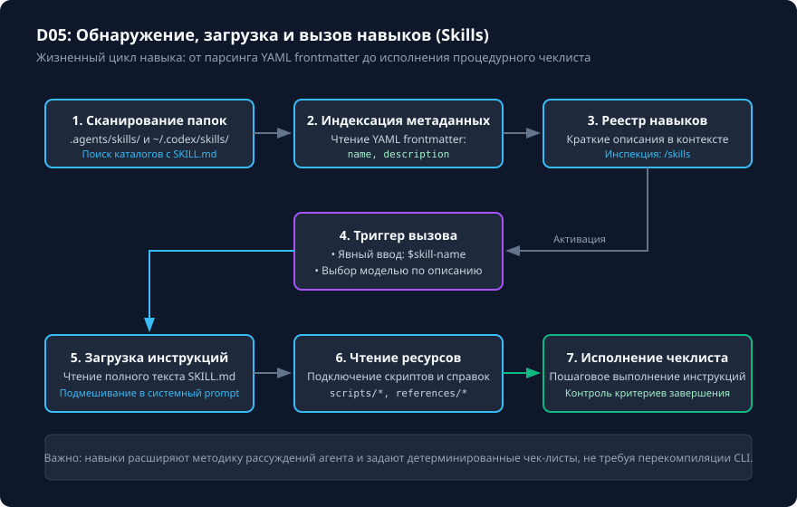

# Создание навыка: от SKILL.md до явного вызова

## Чему вы научитесь

Научитесь создавать и структурировать специализированные навыки (Skills) для Codex CLI 0.160.0, корректно оформлять метаданные в формате YAML frontmatter, проверять обнаружение навыков через команду `/skills`, вызывать навыки явно через префикс `$skill-name` и подключать вспомогательные скрипты и шаблоны.

## Что нужно перед началом

1. Изучите организацию правил проекта из урока [Область действия AGENTS.md и вложенные инструкции](../04-instructions/scope.md).
2. Подготовьте изолированный учебный каталог проекта.
3. Понимание различия: навык (Skill) — это отчуждаемый, модульный чек-лист с четко определённым триггером и процедурой, в отличие от постоянно загруженного `AGENTS.md`.

## Схема процесса

Полный жизненный цикл обнаружения, активации и исполнения навыка представлен на схеме:



### Разбор узлов и стрелок схемы:

- **1. Сканирование каталогов**: Codex при старте или при вызове `/skills` сканирует пути `.agents/skills/*` (проектные навыки) и `~/.codex/skills/*` (глобальные навыки пользователя).
- **Стрелка → 2. Индексация метаданных**: парсер читает YAML-заголовок каждого найденного файла `SKILL.md`, извлекая поля `name` и `description`.
- **Стрелка → 3. Реестр доступных навыков**: формируется компактный каталог, видимый пользователю в интерактивном режиме по команде `/skills`.
- **Стрелка → 4. Развилка «Способ активации»**:
  - *Ветвь «Явный вызов пользователем»*: пользователь напрямую набирает в строке ввода команду `$skill-name [аргументы]`. Это предпочтительный и детерминированный способ.
  - *Ветвь «Автоматический выбор моделью»*: модель в процессе рассуждения видит описание навыка в реестре и самостоятельно решает активировать его для решения подзадачи.
- **Обе ветви сходятся к шагу 5. Загрузка инструкций**: полный текст тела `SKILL.md` динамически подгружается в активный контекст модели.
- **Стрелка → 6. Подключение ресурсов**: если в каталоге навыка присутствуют подпапки `scripts/`, `examples/` или `references/`, агент получает к ним доступ.
- **Стрелка → 7. Исполнение чек-листа**: модель выполняет шаги строго по инструкциям навыка и формирует результат.

## Команды и параметры

Структура каталога навыка в репозитории:

```text
.agents/skills/my-skill/
├── SKILL.md             # Основной файл: метаданные + инструкции (обязателен)
├── scripts/             # Вспомогательные скрипты автоматизации (опционально)
├── examples/            # Образцы входных и выходных данных (опционально)
└── references/          # Дополнительная документация и справочники (опционально)
```

Команды управления навыками в терминале и сессии TUI:

```text
/skills                  # Отображает список всех обнаруженных навыков и их описания
$my-skill arg1 arg2      # Явный вызов навыка с передачей аргументов (префикс $)
```

Флаги CLI для работы с навыками:

```bash
# Запуск сессии без загрузки глобальных пользовательских навыков (только проектные)
codex --no-global-skills

# Проверка синтаксиса манифестов и навыков
python scripts/check_project.py catalog
```

## Разбор примера

Создадим практический навык для ревью безопасности pull request — `diff-review`.

Файл `.agents/skills/diff-review/SKILL.md`:

```markdown
---
name: diff-review
description: Экспертное ревью diff на безопасность, регрессии и соответствие контракту без изменения файлов.
---
# Процедура ревью изменений

Выполняй проверку строго по следующим шагам:
1. Выведи список изменённых файлов и краткую цель проверки.
2. Проверь отсутствие утечки секретов (.env, ключи, auth-файлы).
3. Проверь, что тесты не были ослаблены или удалены.
4. Сформируй не более 3 конкретных замечаний с указанием файла и номера строки.
5. Заверши отчёт итоговым вердиктом: APPROVE или CHANGES_REQUESTED.
Запрещено изменять файлы и выполнять деструктивные команды.
```

Пример вызова в интерактивном TUI:

```text
$diff-review main..feature-branch
```

Наблюдаемый структурированный результат:
```text
=== Ревью изменений: main..feature-branch ===
Проверено файлов: 2 (src/auth.py, tests/test_auth.py)
Безопасность: секреты не обнаружены.
Тесты: добавлены новые позитивные и негативные кейсы.
Замечания: замечаний нет.
Вердикт: APPROVE
```

## Ограничения и безопасность

1. **Изоляция и права**: наличие навыка не даёт ему расширенных прав доступа. Если запуск идёт в режиме `--sandbox read-only`, навык не сможет записать файл, даже если в его тексте написано «сохрани отчёт».
2. **Синтаксис имени**: имя навыка в поле `name` и имя каталога должны совпадать и содержать только символы латиницы в нижнем регистре, цифры и дефис: `^[a-z0-9-]+$`.
3. **Префикс вызова**: пользовательские навыки всегда вызываются через префикс `$skill-name`, а не через косую черту `/`. Символ `/` зарезервирован исключительно для встроенных команд клиента (`/status`, `/compact`, `/plan`).

## Ошибки и диагностика

| Ошибка | Причина | Способ устранения |
|---|---|---|
| Навык не виден в `/skills` | Файл назван не `SKILL.md` (например, `skill.md` или `README.md`) либо каталог лежит вне `.agents/skills/` или `~/.codex/skills/`. | Переименуйте файл в `SKILL.md` строго в верхнем регистре и проверьте путь. |
| `YAML parse error in frontmatter` | Нарушен синтаксис YAML в блоке `---` (например, табуляции вместо пробелов или не закрыты кавычки). | Проверьте заголовок через валидатор YAML или утилиту линтинга. |
| Модель пытается выдумать результат | В вызов передан несуществующий путь, и навык не содержит проверки входных данных. | Добавьте в шаг 1 инструкцию: «Если переданный файл не существует, прерви выполнение и сообщи об ошибке». |

## Практика

1. Создайте в учебном пространстве навык проверки качества документации `docs-check`:
   ```bash
   mkdir -p .learning/workspaces/skills-lab/.agents/skills/docs-check
   cat << 'EOF' > .learning/workspaces/skills-lab/.agents/skills/docs-check/SKILL.md
   ---
   name: docs-check
   description: Проверяет наличие обязательных разделов в учебных уроках Markdown.
   ---
   # Инструкция проверки
   Проверь указанный Markdown-файл:
   1. Убедись в наличии заголовка H1.
   2. Проверь наличие блока самопроверки и подсказок.
   3. Выведи список отсутствующих элементов.
   EOF
   ```
2. Откройте сессию и вызовите навык через `$docs-check README.md`.

<details>
<summary>Подсказка к заданию</summary>

Всегда задавайте чёткий ограничивающий контракт в `SKILL.md`: фиксируйте роль агента, запрещайте нежелательные действия (например, прямую модификацию кода при ревью) и определяйте форму итогового ответа в виде структурированного списка.

</details>

## Самопроверка

Критерии завершения:
1. Вы можете объяснить различие между встроенной slash-командой (начинается с `/`) и навыком (вызывается через `$`).
2. Созданный файл `SKILL.md` корректно разбирается парсером метаданных и отображается в общем реестре.
3. Навык корректно отрабатывает как при передаче валидного пути к файлу, так и при ошибке во входных аргументах.

<details>
<summary>Контрольные вопросы для самопроверки</summary>

- **Вопрос**: В чём ключевое отличие вызова `/learn` от `$learn`?
- **Ответ**: Команда `/goal` или `/status` — это встроенная возможность Codex CLI, а `$learn` — проектный навык, загружаемый из `.agents/skills/learn/SKILL.md`.
- **Вопрос**: Может ли навык запускать внешние bash-скрипты, если Codex запущен с флагом `--sandbox read-only`?
- **Ответ**: Нет, режим песочницы применяется на уровне ядра CLI и блокирует любые модифицирующие операции независимо от инструкций внутри навыка.

</details>

## Источники и применимость

- Целевая версия: **Codex CLI 0.160.0**.
- Документальная сверка: **2026-10-05**.
- [Официальная документация по созданию навыков (Build Skills)](https://learn.chatgpt.com/docs/build-skills).
- [Репозиторий OpenAI Codex (rust-v0.160.0)](https://github.com/openai/codex/tree/rust-v0.160.0).
