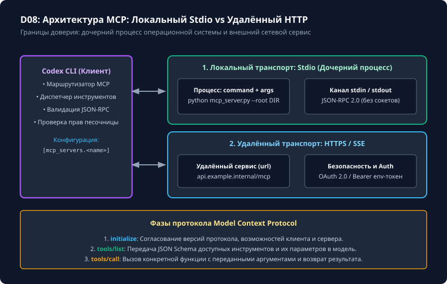

# Настоящий локальный MCP через stdio

## Чему вы научитесь

Научитесь реализовывать и подключать локальные серверы Model Context Protocol (MCP) к Codex CLI 0.160.0 через стандартный ввод/вывод (stdio), понимать структуру сообщений JSON-RPC 2.0 (`initialize`, `tools/list`, `tools/call`), разделять потоки `stdout` и `stderr`, а также обеспечивать безопасность локальной файловой системы при экспорте инструментов.

## Что нужно перед началом

1. Изучите основы безопасности и ограничения путей из урока [Разрешения, песочница и безопасные пути](../03-safety/permissions.md).
2. Понимание формата JSON-RPC 2.0 и механизма межпроцессного взаимодействия (IPC) через каналы `stdin`/`stdout`.
3. Учебные материалы и проверяемое упражнение поставляются в каталоге `examples/local-mcp/`.

## Схема процесса

Архитектура подключения локальных и удалённых серверов MCP к Codex CLI показана на схеме:



### Разбор узлов и стрелок схемы:

- **Клиент Codex CLI (Client)**:
  - Внутренний **Движок сессии (Engine)** формирует высокоуровневые запросы и передаёт их в **Маршрутизатор MCP (Router)**.
  - Двунаправленная стрелка между Engine и Router обеспечивает диспетчеризацию вызовов между зарегистрированными серверами.
- **Локальный транспорт: Stdio (LocalTransport)**:
  - **Дочерний процесс (Subprocess)**: запускается клиентом локально (например, `python mcp_server.py --root ./data`).
  - Двунаправленные стрелки **Pipe (Каналы stdin / stdout)**: обмен сообщениями JSON-RPC 2.0 строго строками JSON, разделёнными переводами строк (`\n`).
  - Стрелка **Subprocess ⟷ LocalFS**: сервер обращается к локальной файловой системе strictly в пределах каталога, указанного через `--root`.
- **Удалённый транспорт: HTTP / SSE (RemoteTransport)**:
  - Альтернативный транспорт для облачных сервисов: сетевой поток HTTPS/SSE с заголовками авторизации (`Authorization: Bearer <token>`).
- **Блок протокола взаимодействия (Protocol)**:
  - *Шаг 1: `initialize`*: согласование версий протокола (2024-11-05/2025-11-25) и возможностей сторон.
  - *Шаг 2: `tools/list`*: клиент запрашивает перечень доступных функций и их JSON Schema.
  - *Шаг 3: `tools/call`*: модель инициирует исполнение инструмента с валидацией аргументов.

## Команды и параметры

Управление подключением MCP-серверов в Codex CLI:

```bash
# Добавление локального сервера stdio в конфигурацию
codex mcp add courseFiles -- python /ABSOLUTE/PATH/mcp_server.py --root /ABSOLUTE/PATH/data

# Просмотр списка всех зарегистрированных MCP-серверов и их статусов
codex mcp list

# Проверка доступных инструментов подключённого сервера
codex mcp get courseFiles

# Удаление зарегистрированного сервера
codex mcp remove courseFiles
```

Конфигурация в `config.toml`:

```toml
[mcp_servers.courseFiles]
command = "python"
args = ["/ABSOLUTE/PATH/mcp_server.py", "--root", "/ABSOLUTE/PATH/data"]
```

## Разбор примера

Рассмотрим обработку вызова инструмента `read_file` локальным stdio-сервером.

1. Запрос от клиента в `stdin` сервера:
   ```json
   {"jsonrpc": "2.0", "id": 1, "method": "tools/call", "params": {"name": "read_file", "arguments": {"path": "notes.txt"}}}
   ```
2. Сервер валидирует аргумент `path`, проверяет, что он не выходит за пределы `--root`, читает файл и возвращает в `stdout`:
   ```json
   {"jsonrpc": "2.0", "id": 1, "result": {"content": [{"type": "text", "text": "Текст заметки из файла"}]}}
   ```
3. Важнейшее требование к коду сервера:
   ```python
   import sys, json

   # ПРАВИЛЬНО: логи и диагностика пишутся ТОЛЬКО в stderr
   print("DEBUG: Запрос получен", file=sys.stderr)

   # ПРАВИЛЬНО: JSON-RPC ответ пишется строго в stdout с переводом строки
   sys.stdout.write(json.dumps(response) + "\n")
   sys.stdout.flush()

   # КАТАСТРОФА: print("Запрос получен") в stdout сломает JSON-парсер клиента!
   ```

## Ограничения и безопасность

1. **Защита стандартного вывода (stdout corruption)**: любые текстовые выводы библиотек, предупреждения интерпретатора или случайные вызовы `print()` в `stdout` мгновенно приводят к разрыву JSON-RPC соединения. Вся отладка должна направляться строго в `sys.stderr`.
2. **Ограничение корневой папки**: сервер должен блокировать любые попытки передачи путей с `..` или абсолютных путей, выходящих за рамки `--root`.
3. **Безопасность параметров процесса**: клиент запускает сервер как дочерний процесс от имени текущего пользователя. Никогда не подключайте недоверенные исполняемые файлы без предварительного аудита кода.

## Ошибки и диагностика

| Ошибка | Причина | Способ диагностики и решения |
|---|---|---|
| `JSONRPCParseError: Unexpected token 'D' in JSON` | Сервер вывел отладочный текст (`DEBUG:...`) в `stdout` вместо `stderr`. | Найдите и перенаправьте все вызовы `print` в `file=sys.stderr`. |
| Процесс сервера зависает при старте | Не вызван `flush()` буфера вывода после записи ответа. | Обязательно вызывайте `sys.stdout.flush()` после отправки каждого JSON-сообщения. |
| Инструменты не видны модели | Сервер не ответил на запрос `tools/list` или вернул невалидную JSON Schema аргументов. | Проверьте работу сервера изолированным скриптом `test.py`. |

## Практика

Выполните проверяемое упражнение по созданию локального stdio MCP-сервера `local-mcp`:

```bash
# 1. Подготовьте изолированное рабочее пространство
python scripts/verify.py --prepare local-mcp

# 2. Перейдите в рабочее пространство:
# .learning/workspaces/local-mcp

# 3. Реализуйте обработку команд initialize, tools/list и tools/call в mcp_server.py
```

<details>
<summary>Подсказка к реализации сервера</summary>

Сервер должен работать в бесконечном цикле `while True: line = sys.stdin.readline()`. При получении пустой строки цикл завершается (клиент закрыл канал). При обработке входящего JSON проверяйте наличие поля `id`: если `id` отсутствует, это уведомление (notification), на которое ответ отправлять не требуется. При наличии `id` ответ обязан содержать то же значение `id`.

</details>

## Самопроверка

Запустите независимый проверочный скрипт:

```bash
python scripts/verify.py --exercise local-mcp --workspace .learning/workspaces/local-mcp
```

Критерии завершения:
1. Тест возвращает `PASS: local-mcp`.
2. Сервер корректно отвечает на запросы рукопожатия `initialize`, отдаёт список инструментов по `tools/list` и выполняет чтение файлов по `tools/call`.
3. Любые попытки выхода за пределы корневого каталога данных завершаются возвратом ошибки JSON-RPC с кодом `-32602` или `-32000`.

<details>
<summary>Разбор эталонной архитектуры</summary>

В эталонном решении `examples/local-mcp/solution/mcp_server.py` реализован минимальный диспетчер:
```python
def handle_message(msg: dict, root_dir: Path) -> dict | None:
    method = msg.get("method")
    msg_id = msg.get("id")
    if method == "initialize":
        return {"jsonrpc": "2.0", "id": msg_id, "result": {"protocolVersion": "2024-11-05", "capabilities": {"tools": {}}}}
    if method == "tools/list":
        return {"jsonrpc": "2.0", "id": msg_id, "result": {"tools": [TOOL_SCHEMA]}}
    if method == "tools/call":
        # Валидация пути и возврат содержимого
        ...
```

</details>

## Источники и применимость

- Целевая версия: **Codex CLI 0.160.0**.
- Документальная сверка: **2026-10-05**.
- [Официальная документация: MCP в Codex CLI](https://learn.chatgpt.com/docs/extend/mcp?surface=cli).
- [Спецификация транспорта Model Context Protocol](https://modelcontextprotocol.io/specification/2025-11-25/basic/transports).
- [Репозиторий OpenAI Codex (rust-v0.160.0)](https://github.com/openai/codex/tree/rust-v0.160.0).
- Материалы: [examples/local-mcp/starter/](../examples/local-mcp/starter/) · [examples/local-mcp/solution/](../examples/local-mcp/solution/) · [examples/local-mcp/test.py](../examples/local-mcp/test.py).
