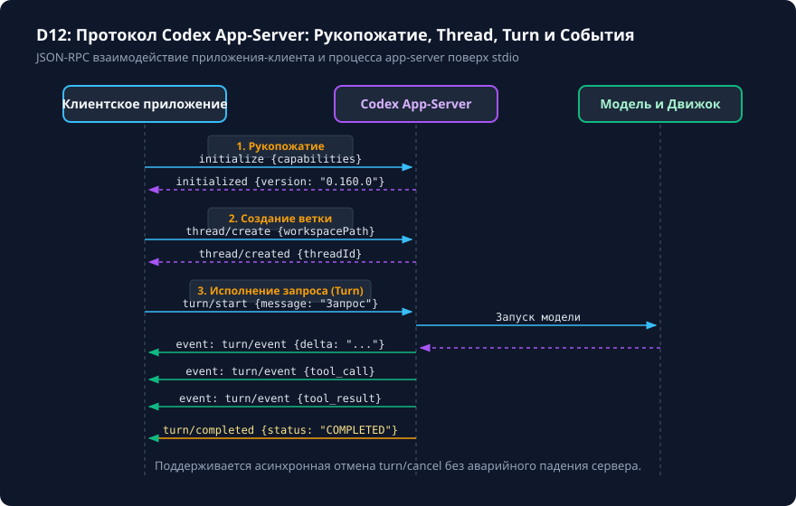

# Граница CLI, MCP server и app-server

## Чему вы научитесь

Научитесь выбирать подходящий уровень интеграции для встраивания возможностей Codex CLI 0.160.0 во внешние приложения, понимать архитектуру долгоживущего сервера `codex app-server`, анализировать протокол взаимодействия через stdio (инициализация, треды, очереди ходов и потоковые события), безопасно управлять отменой операций и отличать современный протокол app-server от устаревшей подкоманды `codex mcp-server`.

## Что нужно перед началом

1. Изучите основы неинтерактивной автоматизации из уроков [Автоматизация: потоковый вывод и неинтерактивный режим](non-interactive.md) и [Настоящий локальный MCP через stdio](../07-mcp/local-stdio.md).
2. Понимание модели клиент-серверного взаимодействия поверх двунаправленных неименованных каналов (stdio pipes).
3. Учебный симулятор клиента поставляется в каталоге `examples/content-depth/automation/app-server/`.

## Схема процесса

Протокол взаимодействия клиентского хост-приложения (IDE / GUI) и `codex app-server` представлен на схеме:



### Разбор узлов и стрелок схемы:

- **Участники взаимодействия**:
  - **Клиентское приложение (Client)**: внешний процесс (плагин IDE, десктопная оболочка или скрипт автоматизации).
  - **Codex App-Server (Server)**: процесс `codex app-server`, запущенный локально и взаимодействующий через stdin/stdout.
  - **Движок & Модель (Core)**: внутренняя логика сессии, контекста и обращения к LLM.
- **Фаза 1: Рукопожатие (Handshake)**:
  - *Стрелка Client → Server (`initialize`)*: клиент передаёт информацию о себе (`clientInfo`) и поддерживаемые возможности (`capabilities`).
  - *Стрелка Server → Client (`initialized`)*: сервер подтверждает согласование версии протокола (`0.160.0`) и возвращает перечень серверных возможностей.
- **Фаза 2: Управление веткой диалога (Thread)**:
  - *Стрелка Client → Server (`thread/create`)*: создание изолированного контекста сессии с указанием рабочего каталога репозитория (`workspacePath`) и профиля.
  - *Стрелка Server → Client (`thread/created`)*: сервер возвращает уникальный идентификатор ветки `threadId`.
- **Фаза 3: Исполнение хода (Turn Execution)**:
  - *Стрелка Client → Server (`turn/start`)*: отправка пользовательского задания с привязкой к `threadId`.
  - *Стрелка Server → Core*: запуск рассуждений модели.
  - *Цикл потоковых событий (Turn Events Loop)*: потоковая передача дельт текста, вызовов инструментов (`tool_call`) и результатов их выполнения (`tool_result`) обратно клиенту без ожидания окончания генерации.
  - *Стрелка Server → Client (`turn/completed`)*: финальное событие с итоговым статусом и статистикой токенов.
- **Фаза 4: Управление отменой (Cancellation)**:
  - *Стрелка Client → Server (`turn/cancel`)*: клиент может в любой момент прервать генерацию, отправив запрос отмены, при этом серверный процесс продолжает работать и сохраняет состояние треда.

## Команды и параметры

Запуск и параметры долгоживущего сервера приложений:

```bash
# Просмотр параметров app-server в CLI 0.160.0
codex app-server --help

# Запуск сервера в режиме ожидания команд через stdio
codex app-server --stdio

# Запуск с привязкой к конкретному профилю настроек
codex app-server --stdio --profile production-agent
```

> **Историческая справка:** Подкоманда `codex mcp-server` удалена из CLI 0.160.0 (`historical_removed`). Официальным долгоживущим протоколом хост-интеграции является `codex app-server`.

## Разбор примера

Рассмотрим реализацию минимального протокола инициализации на стороне клиента:

1. Отправка запроса `initialize` в `stdin` процесса:
   ```json
   {
     "jsonrpc": "2.0",
     "id": 1,
     "method": "initialize",
     "params": {
       "protocolVersion": "0.160.0",
       "clientInfo": {
         "name": "CustomIDEPlugin",
         "version": "1.2.0"
       }
     }
   }
   ```
2. Ответ сервера в `stdout`:
   ```json
   {
     "jsonrpc": "2.0",
     "id": 1,
     "result": {
       "protocolVersion": "0.160.0",
       "serverCapabilities": {
         "threads": true,
         "streaming": true,
         "cancellation": true
       }
     }
   }
   ```
3. Создание треда:
   ```json
   {
     "jsonrpc": "2.0",
     "id": 2,
     "method": "thread/create",
     "params": {
       "workspacePath": "/home/user/project",
       "sandboxMode": "workspace-write"
     }
   }
   ```

## Архитектура Python SDK: CodexSDKClient и адаптеры (ADR-CD-04)

Для встраивания возможностей Codex в бэкенд-сервисы и скрипты автоматизации разработана модульная архитектура Python SDK, изолирующая прикладной код от деталей низкоуровневого stdio-транспорта.

```text
┌────────────────────────────────────────────────────────┐
│                   Прикладной код                       │
├────────────────────────────────────────────────────────┤
│     CodexSDKClient (сессии, таймауты, отмена)          │
├───────────────────────────┬────────────────────────────┤
│    ProductionSDKAdapter   │      FixtureSDKAdapter     │
│   (openai-codex==0.160.0) │    (строгие офлайн-тесты)  │
├───────────────────────────┴────────────────────────────┤
│                  BaseSDKAdapter (интерфейс)            │
└────────────────────────────────────────────────────────┘
```

### Ключевые компоненты:

1. **`BaseSDKAdapter`**: абстрактный контракт жизненного цикла сессий:
   - `start_session(workspace_path, profile)`: инициализация сессии.
   - `send_prompt(session_id, prompt)`: отправка хода и возврат `CodexSDKResult`.
   - `continue_session(session_id, prompt)` / `resume_session(session_id)`: продолжение диалога.
   - `cancel_session(session_id)`: отправка сигнала немедленного прерывания.
2. **`ProductionSDKAdapter`**: производственный адаптер, использующий официальный клиент `openai-codex==0.160.0`. В офлайн-окружении без установленной библиотеки возвращает диагностическое исключение с требованием установки пакета.
3. **`FixtureSDKAdapter`**: строгий детерминированный адаптер для unit- и integration-тестов. Требует явной регистрации ожидаемых пар «промпт → ответ». Фабрикация случайных или неявных ответов запрещена: при незарегистрированном промпте возбуждается ошибка.
4. **`CodexSDKClient`**: высокоуровневый клиент с типизацией:
   - Типизированный результат `CodexSDKResult` (поля `session_id`, `text`, `tool_calls`, `usage`).
   - Иерархия ошибок: `CodexRefusalError` (отказ модели/политики), `CodexExecutionError` (системная ошибка) и `CodexTimeoutError` (таймаут ответа).
   - Поддержка отмены хода через `client.cancel(session_id)`.

### Пример программного использования SDK:

```python
from examples.content_depth.automation.sdk.sdk_client import (
    CodexSDKClient,
    FixtureSDKAdapter,
    CodexRefusalError,
)

# Для тестирования используем строгий FixtureSDKAdapter
adapter = FixtureSDKAdapter()
adapter.register_response(
    prompt="Проверь синтаксис discount.py",
    response_text="Синтаксических ошибок не обнаружено.",
)

client = CodexSDKClient(adapter=adapter)
session = client.start_session(workspace_path=".learning/workspaces/small-fix")

try:
    result = client.send(session.session_id, "Проверь синтаксис discount.py")
    print(f"Ответ SDK: {result.text}")
except CodexRefusalError as err:
    print(f"Отказ выполнения: {err}")
```

## Ограничения и безопасность

1. **Несмешиваемость протоколов**: не направляйте события от `codex exec` в парсер `app-server`. Хотя оба формата используют JSON, схема событий и методы жизненного цикла тредов принципиально различаются.
2. **Изоляция рабочих пространств**: каждый тред создаётся для конкретного пути `workspacePath`. Сервер изолирует операции файловой системы согласно параметру `sandboxMode` этого треда.
3. **Безопасность stdio канала**: как и в MCP, любые случайные записи в stdout на стороне сервера или прокси-скриптов разрушают целостность потока JSON-RPC.

## Ошибки и диагностика

| Ошибка / Симптом | Причина | Способ решения |
|---|---|---|
| `Unknown command: codex mcp-server` | Использование устаревшей команды старой версии. | Перейдите на официальный поддерживаемый интерфейс `codex app-server`. |
| Клиент зависает после отправки `turn/start` | Отсутствие чтения промежуточных потоковых событий `turn/event` в цикле. | Организуйте неблокирующее чтение потока `stdout` или асинхронный цикл обработки. |
| `ThreadNotFound: th_xxx` | Попытка запуска хода в несуществующем или закрытом треде. | Убедитесь, что получен успешный ответ `thread/created` до вызова `turn/start`. |

## Практика

1. Изучите симулятор взаимодействия с app-server:
   ```bash
   cat examples/content-depth/automation/app-server/app_server_stdio_client.py
   python examples/content-depth/automation/app-server/app_server_stdio_client.py
   ```
2. Смоделируйте отправку команды отмены `turn/cancel` во время активного хода.

<details>
<summary>Подсказка к заданию</summary>

При реализации клиента app-server обязательно предусматривайте механизм `turn/cancel`. Это позволяет пользователю нажать кнопку «Стоп» в интерфейсе и моментально прекратить генерацию токенов и выполнение промежуточных инструментов без перезапуска всего сервера и потери открытого контекста треда.

</details>

## Самопроверка

Критерии завершения:
1. Вы можете объяснить фундаментальные отличия одноразового запуска `codex exec` от долгоживущего `codex app-server`.
2. Вы знаете, что подкоманда `codex mcp-server` исключена из текущего CLI и помечена как `historical_removed`.
3. Разобраны все 4 фазы протокола взаимодействия на схеме D12.

<details>
<summary>Контрольные вопросы для самопроверки</summary>

- **Вопрос**: Почему для расширения IDE лучше использовать `codex app-server`, а не многократный вызов `codex exec`?
- **Ответ**: `app-server` держит процесс и контекст в памяти, избегает накладных расходов на повторную инициализацию и парсинг репозитория, а также поддерживает мгновенную отмену ходов и потоковые события.
- **Вопрос**: Какая команда пришла на замену удалённой `codex mcp-server`?
- **Ответ**: Официальный протокол хост-сервера `codex app-server`.

</details>

## Источники и применимость

- Целевая версия: **Codex CLI 0.160.0**.
- Документальная сверка: **2026-10-05**.
- [Официальная документация по архитектуре Codex app-server](https://learn.chatgpt.com/docs/app-server).
- [Справочник команд и интерфейсов Codex CLI](https://learn.chatgpt.com/docs/developer-commands?surface=cli).
- Материалы: [examples/content-depth/automation/app-server/](../examples/content-depth/automation/app-server/).
