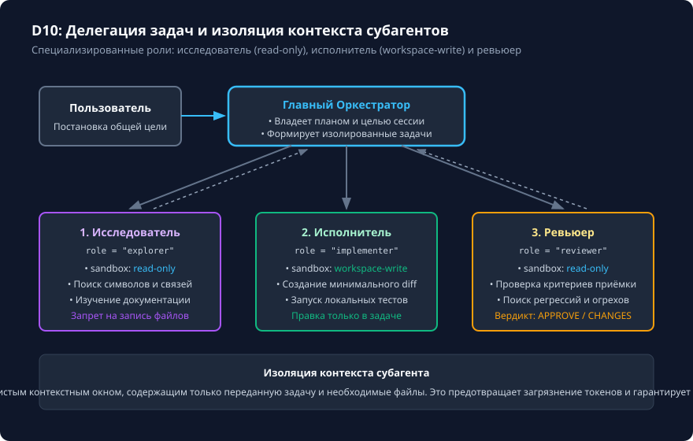

# Роли субагентов и передача результатов

## Чему вы научитесь

Научитесь проектировать многоагентные системы в Codex CLI 0.160.0 с чётким разделением ответственности (Separation of Concerns), настраивать специализированные роли (Explorer, Implementer, Reviewer), ограничивать права доступа субагентов через песочницу и координировать передачу промежуточных результатов без конкурентных конфликтов.

## Что нужно перед началом

1. Изучите организацию правил и ограничений из урока [Область действия AGENTS.md и вложенные инструкции](../04-instructions/scope.md).
2. Понимание концепции неизменяемости контекста и независимости песочниц.
3. Учебные конфигурации субагентов поставляются в `examples/subagents/`.

## Схема процесса

Архитектура оркестрации и делегации задач субагентам показана на схеме:



### Разбор узлов и стрелок схемы:

- **Пользователь → Главный Оркестратор (Orchestrator)**: пользователь формулирует общую цель. Оркестратор формирует план декомпозиции и управляет сквозным выполнением.
- **Стрелка 1: Делегация задачи исследования → Субагент-Исследователь (Explorer)**:
  - *Параметры роли*: `role: explorer`, `sandbox_mode: read-only`.
  - *Задача*: исследовать структуру каталогов, найти функции, проанализировать зависимости.
  - *Обратная стрелка «Возврат отчёта об исследовании»*: структурированный список файлов и точек входа возвращается Оркестратору. Файлы на диске остаются неизменными.
- **Стрелка 2: Делегация задачи реализации → Субагент-Исполнитель (Implementer)**:
  - *Параметры роли*: `role: implementer`, `sandbox_mode: workspace-write`.
  - *Задача*: внести точечные изменения строго по спецификации, сформированной Оркестратором на основе отчёта Исследователя.
  - *Обратная стрелка «Возврат diff и результатов тестов»*: патч и вывод локального теста возвращаются Оркестратору.
- **Стрелка 3: Делегация ревью изменений → Субагент-Ревьюер (Reviewer)**:
  - *Параметры роли*: `role: reviewer`, `sandbox_mode: read-only`.
  - *Задача*: независимый аудит безопасности, проверка отсутствия регрессий и утечки секретов.
  - *Обратная стрелка «Возврат вердикта: APPROVE / CHANGES»*: экспертное заключение передаётся Оркестратору.
- **Оркестратор → Пользователь**: финальный верифицированный результат возвращается человеку только при одобрении Ревьюером и успешном прохождении тестов.

## Команды и параметры

Конфигурация роли субагента задаётся в формате TOML в `.codex/subagents/<role>.toml`:

```toml
name = "reviewer"
description = "Субагент независимого ревью diff без изменения файлов"
sandbox_mode = "read-only"
approval_policy = "untrusted"
developer_instructions = """
Проводи аудит diff на безопасность и регрессии.
Запрещено изменять файлы и выполнять деструктивные команды.
Формируй вердикт: APPROVE или CHANGES_REQUESTED.
"""
```

Команды управления субагентами:

```text
/subagents                  # Список зарегистрированных ролей
/delegate reviewer "Проверь diff между ветками main и feature"
```

## Разбор примера

Рассмотрим совместную работу двух ролей при решении сложной задачи:

1. Оркестратор запускает исследователя:
   ```text
   Роль: explorer. Задача: Найди все места использования устаревшей функции get_auth_token в проекте. Не изменяй файлы.
   ```
2. Исследователь возвращает отчёт:
   ```text
   Функция используется в 2 файлах:
   - src/api/client.py: строка 45
   - src/auth/service.py: строка 112
   ```
3. Оркестратор запускает исполнителя с изолированным заданием:
   ```text
   Роль: implementer. Задача: Замени вызов get_auth_token на get_session_token только в src/api/client.py. Запусти pytest.
   ```
4. Исполнитель вносит минимальный diff и передаёт результат.
5. Оркестратор передаёт diff рецензенту для финального вердикта.

## Ограничения и безопасность

1. **Недопустимость параллельной записи в один файл**: никогда не давайте права `workspace-write` нескольким субагентам одновременно для одного и того же набора файлов, чтобы избежать гонок (race conditions) и конфликтующих diff.
2. **Изоляция прав**: субагенты-исследователи и рецензенты обязаны иметь `sandbox_mode = "read-only"`. Это гарантирует невозможность случайного удаления или повреждения кода при анализе.
3. **Консенсус моделей не заменяет тесты**: если два субагента утверждают, что «код корректен», это не освобождает от запуска независимого детерминированного теста `pytest` или `test.py`.

## Ошибки и диагностика

| Проблема | Причина | Способ решения |
|---|---|---|
| Конфликт изменений в Git | Два субагента одновременно правили пересекающиеся файлы. | Разделяйте зоны ответственности: один агент — один модуль, либо запускайте исполнителей строго последовательно. |
| Ревьюер внёс несанкционированные правки | Для роли ревьюера ошибочно был задан `sandbox_mode = "workspace-write"`. | Установите `sandbox_mode = "read-only"` в конфигурационном файле роли. |
| Оркестратор слепо доверяет галлюцинациям субагента | Отсутствует этап верификации независимым запуском тестов. | Включите в инструкцию Оркестратора обязательный шаг: «Запусти независимый тест перед формированием ответа». |

## Практика

1. Изучите конфигурацию учебных субагентов в `examples/subagents/`:
   - `examples/subagents/explorer.toml`
   - `examples/subagents/reviewer.toml`
2. Проверьте соответствие параметров конфигурации официальному контракту курса:
   ```bash
   python scripts/check_project.py config
   ```
3. Смоделируйте сценарий делегации задачи поиска ошибок без изменения файлов.

<details>
<summary>Подсказка к практическому сценарию</summary>

При описании ролей в TOML всегда используйте секцию `developer_instructions` для формулирования строгих границ: что агенту РАЗРЕШЕНО делать, что КАТЕГОРИЧЕСКИ ЗАПРЕЩЕНО, и в каком формате должен быть представлен финальный вывод (список, таблица, diff).

</details>

## Самопроверка

Критерии завершения:
1. Вы можете объяснить, почему агент-исследователь обязан иметь режим `read-only`.
2. Конфигурация в каталоге `examples/subagents/` успешно проходит проверку `python scripts/check_project.py config`.
3. Вы понимаете разницу между оркестратором верхнего уровня и специализированным субагентом.

<details>
<summary>Контрольные вопросы для самопроверки</summary>

- **Вопрос**: Почему нельзя позволить двум субагентам одновременно реализовывать исправление одного бага?
- **Ответ**: Это приводит к конкурентным конфликтам записи, перезаписи строк в файле и невалидному общему diff.
- **Вопрос**: Является ли согласие двух агентов между собой доказательством отсутствия багов?
- **Ответ**: Нет, только прохождение независимого детерминированного теста с кодом завершения 0 подтверждает корректность.

</details>

## Источники и применимость

- Целевая версия: **Codex CLI 0.160.0**.
- Документальная сверка: **2026-10-05**.
- [Официальное руководство по субагентам Codex](https://learn.chatgpt.com/docs/agent-configuration/subagents).
- [Репозиторий OpenAI Codex (rust-v0.160.0)](https://github.com/openai/codex/tree/rust-v0.160.0).
- Примеры: [examples/subagents/explorer.toml](../examples/subagents/explorer.toml) · [examples/subagents/reviewer.toml](../examples/subagents/reviewer.toml).
