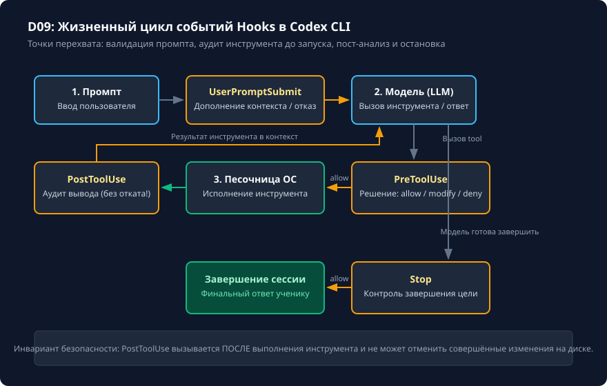

# Нативные hooks: вход, решение и доверие

## Чему вы научитесь

Научитесь разрабатывать и подключать нативные перехватчики событий (Hooks) в Codex CLI 0.160.0, понимать жизненный цикл событий (`UserPromptSubmit`, `PreToolUse`, `PostToolUse`, `Stop`), правильно формировать JSON-RPC ответы для разрешения и блокировки вызовов инструментов, а также разграничивать зоны ответственности хуков и песочницы операционной системы.

## Что нужно перед началом

1. Изучите основы безопасности и разрешений из урока [Разрешения, песочница и безопасные пути](../03-safety/permissions.md).
2. Понимание формата передачи данных через потоки `stdin` и `stdout`.
3. Учебные материалы и проверяемое упражнение поставляются в `examples/extension-hook/`.

## Схема процесса

Полная цепочка жизненного цикла перехватчиков событий в Codex CLI показана на схеме:



### Разбор узлов и стрелок схемы:

- **1. Ввод пользователя (Промпт) → Хук UserPromptSubmit**: перехватчик вызывается сразу после ввода запроса. Позволяет проверить запрос на утечку секретов или дополнить контекст до отправки в модель.
- **Хук UserPromptSubmit → 2. Модель (LLM)**: проверенный и очищенный промпт поступает в языковую модель для рассуждений.
- **Стрелка «Решение вызвать инструмент» → Хук PreToolUse**: вызывается **до** фактического запуска инструмента на диске. Это единственный хук, способный заблокировать (`deny`) операцию или изменить её аргументы (`modify_args`).
  - *Стрелка «allow / modify» → 3. Исполнение инструмента в песочнице*: команда безопасно исполняется в рабочей среде.
  - *Стрелка «deny» → Сообщение об отказе (DenyFeedback)*: сообщение о причине блокировки возвращается обратно модели, инструмент не запускается.
- **Исполнение инструмента → Хук PostToolUse**: вызывается **после** завершения работы инструмента.
  - *Критическое ограничение*: хук видит результат (`tool_output`), но **НЕ может откатить** уже совершённые изменения на диске. Используется для аудита и мониторинга.
- **Стрелка «Генерация ответа завершена» → Хук Stop**: срабатывает в момент, когда модель считает задачу решённой.
  - *Стрелка «allow» → Финальный вывод ученику*: задача завершена.
  - *Стрелка «deny / feedback» → Модель*: хук возвращает требование продолжить цикл (например, если модель не запустила обязательные тесты).

## Команды и параметры

Конфигурация нативных хуков задаётся в файле `hooks.json` в каталоге проекта `.codex/hooks.json` или профиле пользователя:

```json
{
  "hooks": {
    "PreToolUse": [
      {
        "command": "python",
        "args": [".codex/hooks/pre_tool_validator.py"]
      }
    ],
    "PostToolUse": [
      {
        "command": "python",
        "args": [".codex/hooks/audit_logger.py"]
      }
    ]
  }
}
```

Проверка и вызов хуков:

```bash
# Тестирование хука локально через передачу тестового JSON в stdin
cat << 'EOF' | python .codex/hooks/pre_tool_validator.py
{"hookEventName": "PreToolUse", "tool_name": "run_command", "arguments": {"command": "git status"}}
EOF

# Запуск Codex с активацией зарегистрированных хуков
codex --strict-config
```

## Разбор примера

Рассмотрим обработку события `PreToolUse` скриптом `hook_runner.py`:

1. Входные данные поступают в `stdin` скрипта:
   ```json
   {
     "hookEventName": "PreToolUse",
     "tool_name": "run_command",
     "arguments": {
       "command": "rm -rf /"
     }
   }
   ```
2. Обработчик проверяет команду и формирует блокирующий ответ в `stdout`:
   ```json
   {
     "hookSpecificOutput": {
       "hookEventName": "PreToolUse",
       "permissionDecision": "deny",
       "reason": "Деструктивная команда rm -rf отклонена нативным хуком безопасности."
     }
   }
   ```
3. Для разрешённых команд (например, `git status --short`) возвращается разрешение:
   ```json
   {
     "hookSpecificOutput": {
       "hookEventName": "PreToolUse",
       "permissionDecision": "allow"
     }
   }
   ```

## Ограничения и безопасность

1. **Хук не заменяет песочницу ОС**: если скрипт хука завершился аварийно с ошибкой интерпретатора, политика fail-safe клиента либо заблокирует вызов, либо запросит подтверждение пользователя. Хук является программным фильтром, а не аппаратным изолирующим контейнером.
2. **PostToolUse не умеет откатывать действия**: хук пост-обработки не может отменить выполненную запись в файл. Все защитные проверки должны находиться строго в `PreToolUse`.
3. **Безопасность сторонних хуков**: скрипты хуков запускаются локально от вашего имени. Никогда не включайте хуки из недоверенных репозиториев без предварительного аудита исходного кода.

## Ошибки и диагностика

| Ошибка / Симптом | Причина | Способ решения |
|---|---|---|
| `Hook execution failed: exit code 1` | Скрипт хука упал с необработанным исключением Python. | Проверьте скрипт локально: `python hook_runner.py < test.json`. |
| Вывод хука ломает диалог | Скрипт хука вывел посторонний текст в `stdout` вместо валидного JSON. | Направляйте все отладочные сообщения в `sys.stderr`. В `sys.stdout` должен писаться только JSON. |
| Хук не перехватывает действия | Неверно указано имя события (например, `pre_tool` вместо официального `PreToolUse`). | Используйте точные имена событий с соблюдением регистра: `UserPromptSubmit`, `PreToolUse`, `PostToolUse`, `Stop`. |

## Практика

Выполните проверяемое упражнение `extension-hook`:

```bash
# 1. Подготовьте изолированное рабочее пространство
python scripts/verify.py --prepare extension-hook

# 2. Перейдите в рабочее пространство:
# .learning/workspaces/extension-hook

# 3. Реализуйте функцию обработки событий в hook_runner.py
```

<details>
<summary>Подсказка к выполнению упражнения</summary>

Скрипт `hook_runner.py` должен считывать весь вход через `sys.stdin.read()`, парсить JSON и извлекать `hookEventName`. Для события `PreToolUse` необходимо проверять имя инструмента и аргументы: разрешать безопасные команды инспекции Git (`git status --short`) и блокировать произвольные команды оболочки, возвращая JSON со структурой `hookSpecificOutput`.

</details>

## Самопроверка

Запустите независимый проверочный скрипт:

```bash
python scripts/verify.py --exercise extension-hook --workspace .learning/workspaces/extension-hook
```

Критерии завершения:
1. Тест возвращает `PASS: extension-hook`.
2. Проверены позитивные сценарии (разрешение чтения и `git status`) и негативные (блокировка деструктивных вызовов).
3. Вы можете объяснить отличие точки перехвата `PreToolUse` от `PostToolUse`.

<details>
<summary>Разбор контрольного решения</summary>

В эталонном файле `examples/extension-hook/solution/hook_runner.py`:
```python
def process_hook(data: dict) -> dict:
    event = data.get("hookEventName")
    if event == "PreToolUse":
        cmd = data.get("arguments", {}).get("command", "")
        if cmd == "git status --short":
            return {"hookSpecificOutput": {"hookEventName": "PreToolUse", "permissionDecision": "allow"}}
        return {"hookSpecificOutput": {"hookEventName": "PreToolUse", "permissionDecision": "deny", "reason": "Запрещено"}}
    return {}
```

</details>

## Источники и применимость

- Целевая версия: **Codex CLI 0.160.0**.
- Документальная сверка: **2026-10-05**.
- [Официальная документация по нативным хукам Codex](https://learn.chatgpt.com/docs/hooks).
- [Репозиторий OpenAI Codex (rust-v0.160.0)](https://github.com/openai/codex/tree/rust-v0.160.0).
- Материалы: [examples/extension-hook/starter/](../examples/extension-hook/starter/) · [examples/extension-hook/solution/](../examples/extension-hook/solution/) · [examples/extension-hook/test.py](../examples/extension-hook/test.py).
