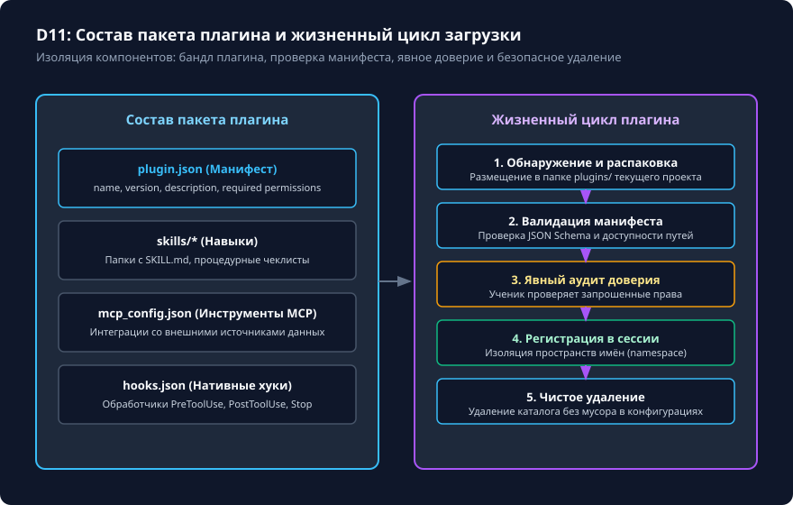

# Плагины: упаковка без автоматического доверия

## Чему вы научитесь

Научитесь проектировать, упаковывать и инспектировать расширения в формате плагинов (Plugin Bundles) для Codex CLI 0.160.0, понимать структуру манифеста `plugin.json`, управлять разграничением прав (`permissions`), изолировать пространства имён навыков и предотвращать несанкционированную автоматическую активацию недоверенного кода.

## Что нужно перед началом

1. Изучите уроки по созданию навыков [Создание навыка: от SKILL.md до явного вызова](../06-skills/create.md) и хуков [Нативные hooks: вход, решение и доверие](plugins-hooks.md).
2. Понимание модели разрешений и рисков запуска сторонних расширений.
3. Учебный пакет плагина поставляется в каталоге `examples/content-depth/extensions/plugin/`.

## Схема процесса

Анатомия пакета плагина и фазы его жизненного цикла показаны на схеме:



### Разбор узлов и стрелок схемы:

- **Анатомия пакета плагина (Plugin Bundle)**:
  - **Манифест `plugin.json`**: центральный декларативный файл пакета, определяющий метаданные (`name`, `version`, `description`) и список запрошенных привилегий (`permissions`).
  - **Каталог навыков `skills/*`**: набор переносимых навыков с инструкциями `SKILL.md`.
  - **Конфигурация MCP `mcp_config.json`**: декларация встроенных серверов инструментов.
  - **Нативные хуки `hooks.json`**: перехватчики событий жизненного цикла.
- **Жизненный цикл установки и работы (Lifecycle)**:
  - **Шаг 1: Обнаружение и распаковка**: скачивание или распаковка пакета в каталог `.codex/plugins/<plugin-name>/`.
  - **Стрелка → Шаг 2: Валидация манифеста**: проверка соответствия схеме JSON Schema, контроль семантической версии и проверка списка прав.
  - **Стрелка → Шаг 3: Явное подтверждение доверия**: критический рубеж безопасности. Пользователь в явном диалоговом окне одобряет установку плагина. Автоматическая тихая установка категорически запрещена.
  - **Стрелка → Шаг 4: Регистрация в сессии**: навыки регистрируются с префиксом пространства имён (`$plugin-name:skill-name`), исключая конфликты имен с локальными навыками.
  - **Стрелка → Шаг 5: Чистое удаление / Отключение**: деактивация плагина удаляет все ссылки из сессии без остаточных изменений в глобальном профиле пользователя.

## Команды и параметры

Команды управления плагинами в Codex CLI:

```bash
# Просмотр списка установленных и активных плагинов
codex plugins list

# Проверка манифеста и запрашиваемых разрешений локального пакета
codex plugins inspect ./my-plugin

# Установка плагина с запросом подтверждения
codex plugins install ./my-plugin

# Удаление установленного плагина
codex plugins remove my-plugin
```

Внутри интерактивной сессии TUI:
```text
/plugins                 # Просмотр активных плагинов и их компонентов
$my-plugin:demo-tool     # Вызов навыка из пространства имён плагина
```

## Разбор примера

Рассмотрим манифест учебного плагина `plugin.json` из `examples/content-depth/extensions/plugin/plugin.json`:

```json
{
  "name": "course-extension-pack",
  "version": "1.0.0",
  "description": "Учебный плагин с набором проверочных навыков и хуков для Codex CLI",
  "author": "Codex Course Team",
  "permissions": [
    "read_workspace"
  ],
  "skills_dir": "skills",
  "hooks_file": "hooks.json"
}
```

Анализ безопасности перед установкой:
1. Запрошено только право `read_workspace` (чтение файлов рабочего каталога).
2. Отсутствуют права на запись (`write_workspace`), сетевой доступ (`network_access`) или запуск системных процессов без подтверждения (`exec_command`).
3. При попытке плагина вызвать недопустимое действие сработает песочница ядра CLI.

## Ограничения и безопасность

1. **Запрет автоматической активации**: репозиторий курса строго следует правилу — никакие сторонние плагины, хуки или MCP-серверы не должны активироваться автоматически при открытии проекта без ведома пользователя.
2. **Изоляция пространств имён**: чтобы два разных плагина не конфликтовали из-за одинаковых названий навыков (например, `format` или `lint`), CLI изолирует их именами пакетов: `$pack-a:lint` и `$pack-b:lint`.
3. **Лицензии и происхождение**: перед установкой плагинов из публичных источников проверяйте целостность хэшей манифеста и отсутствие вредоносного кода в подключаемых Python/Node.js скриптах.

## Ошибки и диагностика

| Симптом | Причина | Способ диагностики и решения |
|---|---|---|
| `PluginValidationError: missing field 'version'` | Манифест `plugin.json` не соответствует официальной схеме. | Добавьте обязательные поля: `name`, `version`, `description`. |
| Навык плагина не вызывается по короткому имени | Навыки плагинов требуют указания пространства имён. | Используйте формат вызова с префиксом: `$имя-плагина:имя-навыка`. |
| `PermissionDenied: network_access not granted` | Плагин попытался сделать сетевой запрос, не объявив соответствующее право в манифесте. | Добавьте требуемое право в `permissions` манифеста и заново подтвердите доверие. |

## Практика

1. Изучите структуру учебного пакета плагина:
   ```bash
   ls -la examples/content-depth/extensions/plugin/
   cat examples/content-depth/extensions/plugin/plugin.json
   ```
2. Проверьте синтаксис манифеста встроенным парсером JSON:
   ```bash
   python -m json.tool examples/content-depth/extensions/plugin/plugin.json
   ```
3. Составьте план безопасного удаления плагина, исключающий остаточные файлы.

<details>
<summary>Подсказка к заданию</summary>

При проектировании манифеста плагина руководствуйтесь принципом наименьших привилегий (Least Privilege). Если плагин выполняет только форматирование кода, запрашивайте только доступ к файлам репозитория и никогда не требуйте прав сетевого доступа или глобальной конфигурации.

</details>

## Самопроверка

Критерии завершения:
1. Вы понимаете все 5 фаз жизненного цикла плагина (от распаковки до чистого удаления).
2. Вы можете объяснить, почему плагин не должен активироваться скрытно.
3. Проверена структура манифеста `plugin.json` и изоляция пространства имён навыков.

<details>
<summary>Контрольные вопросы для самопроверки</summary>

- **Вопрос**: Почему плагин не может автоматически установить и включить произвольный MCP-сервер без ведома пользователя?
- **Ответ**: Потому что сторонний MCP-сервер запускает локальный бинарный процесс с правами пользователя, что представляет критическую угрозу безопасности без явного одобрения.
- **Вопрос**: Что происходит при удалении каталога плагина из `.codex/plugins/`?
- **Ответ**: Все зарегистрированные в нём навыки и хуки мгновенно становятся недоступными в сессии, а системный профиль остаётся чистым.

</details>

## Источники и применимость

- Целевая версия: **Codex CLI 0.160.0**.
- Документальная сверка: **2026-10-05**.
- [Официальная спецификация архитектуры плагинов OpenAI](https://developers.openai.com/plugins/build/plugins).
- [Справочник команд интерфейса Codex CLI](https://learn.chatgpt.com/docs/developer-commands?surface=cli).
- Материалы: [examples/content-depth/extensions/plugin/](../examples/content-depth/extensions/plugin/).
