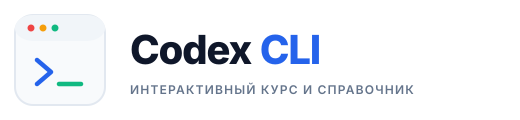

<picture>
  <source media="(prefers-color-scheme: dark)" srcset="resources/logos/codex-logo-dark.svg">
  
</picture>

# Участие в развитии проекта Codex How-To / Contributing

Мы приветствуем вклад в развитие русскоязычного интерактивного курса и справочника по **Codex CLI**.

---

## Как внести вклад

### 1. Форк и клонирование репозитория
```bash
git clone https://github.com/RuslanGrigorev/codex-howto.git
cd codex-howto
```

### 2. Принципы разработки
- **100% Офлайн**: любые новые уроки, примеры и тесты должны быть полностью работоспособны без подключения к внешним серверам или платным API.
- **Детерминированность**: упражнения в `examples/` должны иметь эталонное решение (`solution/`), заготовку (`starter/`), тесты (`test.py`) и минимум 2 ошибочные мутации, демонстрирующие надёжность проверки.
- **Совместимость с OpenSpec**: любые архитектурные изменения оформляются через каталог `openspec/`.
- **Чистота путей**: запрещено использовать абсолютные пути локального компьютера разработчика (`C:\Users\...`, `/home/...`).

### 3. Локальная проверка качества
Перед отправкой изменений обязательно запустите единый скрипт верификации:
```bash
python scripts/verify.py --profile offline
```

А также проверьте корректность генерации статического сайта:
```bash
python scripts/build_website.py --output site
```

### 4. Отправка Pull Request
1. Создайте тематическую ветку (`git checkout -b feat/my-improvement`).
2. Зафиксируйте изменения понятными коммитами по стандарту Conventional Commits (`feat: ...`, `fix: ...`, `docs: ...`).
3. Убедитесь, что `python scripts/verify.py --profile offline` возвращает `PASS`.
4. Откройте Pull Request в репозиторий [RuslanGrigorev/codex-howto](https://github.com/RuslanGrigorev/codex-howto).

---

## English Summary

We welcome contributions to the **Codex CLI** interactive course and reference guide.
- Clone the repository: `git clone https://github.com/RuslanGrigorev/codex-howto.git`
- Ensure all additions are 100% offline-compatible.
- Run tests via `python scripts/verify.py --profile offline`.
- Submit pull requests against [RuslanGrigorev/codex-howto](https://github.com/RuslanGrigorev/codex-howto).
